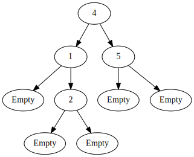
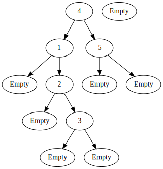
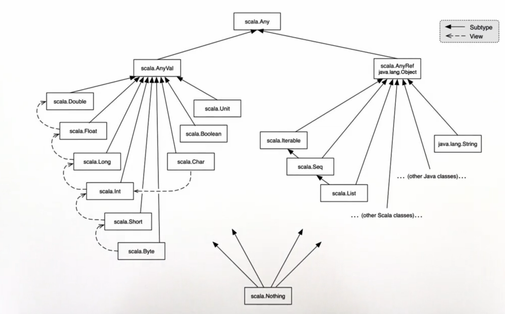
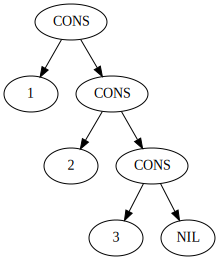

# Class Hierarchies

There are situations where its natural to describe a data type conceptually as a hierarchy of several classes. Consider the task of writing a class for sets of integers with the following operations:
```
abstract class IntSet:
  def incl(x: Int): IntSet
  def contains(x: Int): Boolean
```
Here `IntSet` is an __abstract class__ - classes that can contain members which are missing an implementation (in our case, both _incl_ and _contains_ are missing implementation and these are called as __abstract members__). Consequently, no direct instances of an _abstract class_ can be created. For instance, an `IntSet()` call would be `illegal`. _Abstract classes_ can extend and be extended by _abstract_ or _non-abstract_ classes. You can use the `extend` keyword to extend an abstract class.

Let's consider implementing sets as `binary trees`. There are two types of possible trees: a tree for the empty set, and a tree consisting of an integer and two _sub-trees_.
Here are their implementations:
```
class Empty() extends IntSet:
  def contains(x: Int): Boolean = false // an empty set contains no element so it always returns false
  def incl(x: Int): IntSet = NonEmpty(x, Empty(), Empty()) // including an element into the empty set will return a 
  // node linked to two empty nodes
```
Here, the `extends` keyword says that the class 'Empty' conforms to the `interface / abstract class` _IntSet_, _ie_, _Empty_ implements all the _methods_ that are defined in _IntSet_.

The set `{1, 2, 4, 5}` could lead to the following tree:




Notice that for a given node in the tree, its left sub-tree contains numbers less that the node and the right sub-tree contains numbers greater than the node. Such a tree is called as __Binary Tree__. We want to use this variant of the tree because it makes it efficient to query the set with the _contains_ method and add elements to the set with the _incl_ method.

For an empty set, the _contains_ method will always return _false_ and the _incl_ method would create a non-empty set with the included element and two empty sub-trees. 

The implementation of the _NonEmpty_ class for a non-empty set (this class is required to implement the empty set as well):
```
class NonEmpty(elem: Int, left: IntSet, right: IntSet) extends IntSet:
  def contains(x: Int): Boolean =
    if (x < elem) left.contains(x)
    else if (x > elem) right.contains(x)
    else true
  def incl(x: Int): IntSet =
    if (x < elem) NonEmpty(elem, left.incl(x), right)
    else if (x > elem) NonEmpty(elem, left, right.incl(x))
    else this
end NonEmpty
```
Here, `elem` represents the current node which is a root of a binary _sub-tree_. `left` corresponds to the left branch of this binary _sub-tree_ and `right` corresponds to the right branch of this binary _sub-tree_.

If we now add an element `3` to the set `{1, 2, 4, 5}` that is represented above, it would be added as a right sub-tree to node `2` where the left and right of the inserted node `3` will be _Empty_. It follows the `4 -> 1 -> 2  -> Empty` route for insertion in the tree. This new tree would look like this:



Such data structures, which allow to incrementally create new forms from the old structure without any change in the old structure are called as __persistent data structures__. They allow creation of new data structures from old ones.


# Base Classes and Subclasses

_IntSet_ is called `superclass` of _Empty_ and _NonEmpty_. _Empty_ and _NonEmpty_ are `subclasses` of _IntSet_. In Scala, any user-defined class extends another class. If no _superclass_ is given, the standard class `Object` in the the Java package `java.lang` is assumed. The direct or indirect superclasses of a class `C` are called as `base classes` of `C`. So, the _base classes_ of _NonEmpty_ include _IntSet_ and _Object_.


# Implementation and Overriding

The definitions of _contains_ and _incl_ in the classes _Empty_ and _NonEmpty_ `implement`  the abstract functions in the base trait _IntSet_. It is also possible to `redefine` an existing, non-abstract definition in a subclass by using `override`. For Example:
```
abstract class Base {
  def foo = 1
  def bar: Int // Setting the type of bar as Int, it can take any integer value
}
class Sub extends Base {
  override def foo = 2 // this definition takes precedence over the definition in the Base class due to overriding
  def bar = 3
}
```


# Object Definitions

In the _IntSet_ example, one could argue that there is really only a single empty _IntSet_. So, it seems overkill to have the user create many instances of it. We can express this case better with an `object definition`:
```
object Empty extends IntSet:
  def contains(x: Int): Boolean = false
  def incl(x: Int): IntSet = NonEmpty(x, Empty, Empty)
end Empty 
```
This defines a `singletod object` named _Empty_. No other _Empty_ instance can be (or needs to be) created. __Singleton objects__ are values, so _Empty_ evaluates to itself.


# Companion Objects

An object and a class (including abstract classes) can have the same name. This is possible since Scala has two global `namespaces`, one for types and one for values. Classes live in the type _namespace_, whereas objects live in the term _namespace_.
If a class and object with the same name are given in the same _sourcefile_, we call them `companions`. For example:
```
abstract class IntSet:
  def incl(x: Int): IntSet
  def contains(x: Int): Boolean
object IntSet:
  def singleton(x: Int) = NonEmpty(x, Empty, Empty)
```
This defines a method to build sets with one element, which can be called as `IntSet.singleton(elem)`.
A _companion object_ of a class plays a role similar to `static class definitions` in Java (which are absent in Scala).


# Programs

So far, we have executed all Scala code from the REPL or the worksheet. But it is also possible to create standalone applications in Scala. Each such application contains an object with a `main` method. Similar to Java, this `main` _method_ should take a single argument which is an array of strings. For instance, here is the [Hello World](Hello.scala) program in Scala:
```
object Hello:
  def main(args: Array[String]): Unit = println("Hello world!")
```
Once this program is compiled (command-line: `scalac Hello.scala`), you can start it from the command-line with:
```
> scala Hello
```
The body of the `main` _method_ will be executed when the program is called like this. Writing _main_ methods is similar to what Java does for programs. Scala also has a more convenient way to do it. A stand-alone application is alternatively, a function that's annotated with `@main`, and that can take command line arguments as parameters like [this](Birthday.scala):
```
@main def Birthday(name: String, age: Int) = 
  println(s"Happy Birthday ${name}!, ${age} years old already!")
``` 
Once this function is compiled (command-line: `scalac Birthday.scala`), you can start it from the command-line with:
```
> scala Birthday Peter 11
```

__Exercise:__

Write a method _union_ for forming the union of of two sets. You should implement the following abstract class:
```
abstract class IntSet:
  def incl(x: Int): IntSet
  def contains(x: Int): Boolean
  def union(other: IntSet): IntSet
end IntSet
```

[Solution](intsets.worksheet.sc)


# Dynamic Binding

One interesting consequence of class hierarchies in Scala (and other Object-oriented languages), is that they lead to `dynamic method dispatch`. This means that the code invoked by a method call `depends on the runtime type` of the object that contains the method. 

Example:

          Empty.contains(1)
    -->   \[1/x\]\[Empty/this\] false
  
    =     false

evaluation using NonEmpty,

          (NonEmpty(7, Empty, Empty)).contains(1)
    -->   \[7/elem\][7/x][new NonEmpty(7, Empty, Empty)/this]
  
    -->   if (x < elem) this.left.contains(x)
          else if (x > elem) this.right.contains(x) else true
  
    =     if (7 < 7) NonEmpty(7, Empty, Empty).left.contains(7)
          else if (7 > 7) NonEmpty(7, Empty, Empty).right.contains(7) else true

    =     true

What we see here is that the sequence of reductions that gets performed depends on the value to the left-hand-side of the _method_. This is `dynamic binding` or `dynamic dispatch`.

_Dynamic dispatch_ of methods is analogous to calls to _higher order functions_. Can we implement one concept in terms of the other ?
  * _Objects_ in terms of _higher-order functions_ ? `Yes`
      * You can implement _objects_ as a _record_ of `closures` closing over a common environment. In fact, that's exactly how _objects_ are implemented in _ECMAScript_ (In _ECMAScript_, records are confusingly called as `objects({})`).
      * If you don't have _records_, or you subscribe to the `message-oriented paradigm` of __Object-Oriented__ systems, you can use a `selector function` instead, which takes the `message` as a parameter and returns a `closure` based on the `message`. 
  * _Higher-order functions_ in terms of _objects_ ? `Yes`
      * An _object_ with a single _method_ is isomorphic to a function.
      * An _object_ with a single _method_ and some _instance variables_ is isomorphic to a `closure`.
      * An _object_ with a single _method_ that takes an _object_ with a single _method_ as parameter or returns an _object_ with a single method is isomorphic to a _higher-order function_.


# Packages

Classes and Objects are organized into __packages__. To place a class or object inside a package, use the `package` clause at the top of your `*.scala` source file. _Packages_ are essentially very large _objects_ with its _members_ stored in individual source files.
```
package progfun.example

Object Hello
```
This would place _Hello_ in the _package_ `progfun.example`. You can then refer to it by its _fully qualified name_, `progfun.example.Hello`. Usually, you would organize your sources so that you would have them inside a directory structure like `progfun/example/Hello.scala`. To run the _Hello_ program after compilation:
```
> scala progfun.example.Hello
```

Say we have a package _Rational_ in package _Week3_, you can use the class with its _fully qualified name_:
```
val r = week3.Rational(1, 2)
```
Alternatively, you can use an `import`:
```
import week3.Rational
val r = Rational(1, 2)
```

Several forms of `imports`:
```
import week3.Rational                   // imports just Rational
import week3.{Rational, Hello}          // imports both Rational and Hello
import week3._                          // imports evecything in package week3
```
The first two forms are called __named imports__. The last form is called a __wildcard import__. You can _import_ from either a `package` or an `object`.

Some entities are automatically imported in any Scala program. These are:
  * All members of _package_ `scala`
  * All members of _package_ `java.lang`
  * All members of the _singleton object_ `scala.Predef`

The _fully qualified names_ of some _types_ and _functions_ we have seen so far:
    Int             _scala.Int_
    Boolean         _scala.Boolean_
    Object          _java.lang.Object_
    require         _scala.Predef.require_
    assert          _scala.Predef.assert_


You can explore the standard Scala library using the scaladoc web pages.
You can start at: [www.scala-lang.org/api/current](www.scala-lang.org/api/current)


# Traits

in Java, as well as in Scala, a class can only have one `superclass`. But what if a class has several natural supertypes to which it conforms or from which it wants to inherit code ? Here, you could use `traits`. A __trait__ is declared like an _abstract class_, just with the `trait` keyword instead of `abstract class`.
```
trait Planar:
  def height: Int
  def width: Int
  def surface = height * width
```

_Classes_, _objects_ and _traits_ can inherit from at most one class but arbitrary many _traits_. Example:
```
class Square extends Shape, Planar, Movable ...
```
_Traits_ resemble `interfaces` in Java, but are more powerful because they can have parameters and can contain fields and concrete methods.


# Scala's Class Hierarchy





The _Any_ class has two subtypes - _AnyVal_ and _AnyRef_. _AnyVal_ is the common superclass of all `primitive types`. There are nine _primitive types_ in Java as well as Scala: `Double`, `Float`, `Long`, `Int`, `Short`, `Byte`, `Unit`, `Boolean`, `Char`. On the other side, most user-defined data types are sub-classes of _AnyRef_ which is just an alias for _java.lang.Object_, the root class of Java. The Typical sub-classes of _AnyRef_ include `Sting`, `List`, `Seq`, `Iterable` and `other Scala classes defined by the user or the system`. 

Similar to the topmost class of type _Any_, Scala also has a bottom class called _Nothing_ that is a subtype of all the pother type classes. The _Nothing_ type does not have any value. It represents a computation that never returns a value, or a computation that loops forever and never terminates, or a computation that finishes with an _exception_ instead of a normal _return value_. Why is that useful ?
  * To signal `abnormal termination`
  * As an element type of `empty collections`

The arrows in the figure mean _sub-typing_, _ie_, everything to the bottom of an arrow conforms to the thing at the top of the arrow. The _dashed_ arrows represent type _conversions_. Note that in a _sub-type_ relationship represented by a solid arrow, the classes on either end of the arrow typically have the same representation, whereas for a _conversion_, the representation of the classes on either end of the _dashed_ arrow changes internally. For example, _Long_ has twice the bits of an _Int_.

At the top of the hierarchy, we find:

    Any                             the base type of all types
                                    Methods: '==', '!=', 'equals', 'hashCode', 'toString'
    
    AnyRef                          The base type of all reference types;
                                    Alias of _java.lang.Object_

    AnyVal                          The base type of all primitive types


# Exceptions

Scala's `exception handling` is similar to Java's.
The expression
```
throw Exec
```
`aborts` evaluation with the _exception_ `Exc`. The type of this expression is _Nothing_.
```
def f: String = throw Exception()
```
has type _Nothing_ which extends _String_. Therefore, `f` is a valid function.

What is the type of this Expression ?

```
if (true) 1 else false
```
The two branches of the `if` condition return an _Int_ and a _Boolean_. Their `common supertype` is _AnyVal_. So, the type returned by this expression is _AnyVal_. The comoiler is intentionally not returning the obvious _Int_ subtype because, it would lead to instability of programs. If you change the `if(true)` condition to something that is less obviously _true_ like some expression `if(p)`, then the _type_ of the `if` condition would become less good - It would go from _Int_ to _AnyVal_.


# Cons-Lists

A fundamental data structure in many functional languages is the _immutable_ `linked list`. It is constructed from two building blocks:
  * `Nil`   - the empty list
  * `Cons`  - a cell containing an element and the remainder of the list

Examples for `Cons-Lists`:
```
List(1, 2, 3)
```
This list would be represented as:


The three `Cons` cells each contain `one` of the element of the _List_ and the remainder is the list that contains the other elements. The `List(1,2,3)` would start with a `Cons` cell containing the _List_ element `1` and would contain as the second half, `List(2, 3)` which inturn contains as the third half `List(3)` which would finally contain `Nil`.


```
List(List(true, false), List(3))
```
You can construct _Lists_ recursively be adding progressively, more and more elements at the front. _Lists_ can contain other _Lists_ within them and can also contain _Lists_ of different _Types_. The structure of this _List_ would look like:




This structure contains a `Cons` cell that contains a _List_ as its first element and the rest of that list would be another _List_, containing `3` as its element and `Nil` as the rest.


Here's an outline of a class hierarchy that represents lists of integers in this fashion:
```
package week3

trait IntList ...
class Cons(val head: Int, val tail: IntList) extends IntList ...
class Nil() extends IntList ...
```

A _List_ is either:
  * an empty _List_ `Nil()`, or
  * a list Cons(x, xs) containing of a head element `x` and a tail element `xs`


__Value Parameters:__
Note the abbreviation `(val head: Int, val tail: IntList)` in the definition of `Cons`.
This defines at the same time _parameters_ and _fields_ of a class. 
It is equivalent to:
```
class Cons(_head: Int, _tail: IntList) extends intList:
  val head = _head
  val tail = _tail
```
where `_head` and `_tail` are otherwise unused names.

__Type Parameters:__
It seems too narrow to define only lists with _Int_ elements. We'd need another class hierarchy for _Double_ lists, and so on, for each possible element _Type_. We can generalize the definition using a `type parameter`:
```
// Note: All classes are in Uppercase to avoid conflicts with Scala's predefined 'List' and 'Nil' classes.
trait LIST[T]:
// Cons cell
class CONS[T](val head: T, val tail: List[T]) extends List[T]
// Nil cell
class NIL[T] extends List[T]
```
__Type parameters__ are written in square brackets, _eg_. `[T]`


__Complete Definition of List (Class Hierarchy):__

```
trait LIST[T]:
  def isEmpty: Boolean
  def head: T
  def tail: LIST[T]
end LIST
class CONS[T](val head: T, val tail: LIST[T]) extends LIST[T]:
  def isEmpty = false
  // Since defining the parameters with 'val' already defines them as read-only fields, we do't have to
  // define them again inside the class body
end CONS
class NIL[T] extends LIST[T]:
  def isEmpty = true
  def head = throw new NoSuchElementException("NIL.head")
  def tail = throw new NoSuchElementException("NIL.tail")
end NIL
```

__Generic Functions:__
Just like classes, functions can also have _type parameters_. For instance, here is a function that creates a list consisting of a single element:
```
def singleton[T](elem: T) = CONS[T](elem, NIL[T])
```
We can then write:
```
singleton[Int](1)
singleton[Boolean](true)
```

__Type Inference:__
The Scala compiler can usually deduce the correct type parameters from the value arguments of a function call.
So in most cases, _type parameters_ can be left out. You could also write:
```
singleton(1)    // CONS[Int]
singleton(true) // CONS[Boolean]
```

__Types and Evaluation:__
_Type parameters_ do not affect evaluation in Scala. We can assume that all _type parameters_ and _type arguments_ are removed before evaluating the program (_type parameters_ are a compiler-only property). This property is also called __type erasure__. Languages that use `type erasure` include `Java`, `Scala`, `Haskell`, `ML`, `OCaml`. Some other languages keep the _type parameters_ around at compile time, these include: `C++`, `C#`, `F#`.


__Polymorphism:__

`Polymorphism` means that a function type comes `in many forms`. In programming, it means that
  * the function can be applied to arguments of many _types_, or
  * the _type_ can have instances of many _types_


We have seen two principal forms of `Polymorphism`:
  * `subtyping`: instances of a subclass can be passed to a base class (subtype polymorphism)
  * `generics`: instances of a function or class are created by _type parameterization_.


__Exercise:__

Write a function `nth` that takes a list and an integer `n` and selects the _n_'th element of the list
```
def nth[T](xs: List[T], n: Int): T = ???
```
Elements are numbered from 0. If index is outside the range from 0 up ot the length of the list minus one, an `IndexOutOfBoundsException` should be thrown.

[Solution](Lists.worksheet.sc)


# Pure Object Orientation

A _pure object-oriented_ language is one in which every value is an object. If the language is based on classes, this means that the _type_ of each value is a class. Is Scala a _pure object-oriented_ language ? At first glance, there seem to be some exceptions: _primitive types_, _functions_. But lets take a closer look.

__Standard Classes:__
Conceptually, types such as _Int_ or _Boolean_ do not recieve special treatment in Scala. They are like the other classes, defined in the package `scala`. For reasons of efficiency, the Scala compiler represents the values of _type_ `scala.Int` by 32-bit integers, and the values of _type_ `scala.Boolean` by Java's _Boolean_, etc. A class such as _Int_ or _Boolean_ is represented by the computer quite differently from an _object_. An _object_ is typically a multi-word _record_ (_record_ with multiple fields / members) on the `heap` of program execution. An _Int_ or _Boolean_ is just a primitive value that can sit in a _register_.


__Pure Booleans:__
For efficiency, the _Boolean_ type maps to the JVM's primitive type _boolean_. But one could define it as a class from first principles:
```
package idealized.scala
abstract class Boolean extends AnyVal:
  // 'IfThenElse' resembles an 'if' expression. It takes two parts: 't' and 'e' which are the 'if then' and 'else'
  // parts. They are both 'call-by-name' parameters of arbitrary types.
  def IfThenElse[T](t: => T, e: => T): T
  // The following method definitions depend only on the definition of 'IfThenElse'. Hence, they need not be defined
  // agian in the objects extending this abstract class.
  // 'And' takes a 'call-by-name' parameter 'x' and it returns IfThenElse(x, false)
  def && (x: => Boolean): Boolean = IfThenElse(x, false)
  def || (x: => Boolean): Boolean = IfThenElse(true, x)
  def unary_!: Boolean            = IfThenElse(false, true)
  def == (x: Boolean): Boolean    = IfThenElse(x, x.unary_!)
  def != (x: Boolean): Boolean    = IfThenElse(x.unary_!, x)
  ...
end Boolean
```
Here are constants _true_ and _false_ that go with _Boolean_ in `idealized.scala`:
```
package idealized.scala

// For true, IfThenElse will always pick the 'if then' part
// true.IfThenElse(a, b) = a
object true extends Boolean:
  def IfThenElse[T](t: => T, e: => T): t

// For false, IfThenElse will always pick the 'else' part
// false.IfThenElse(a, b) = b
object false extends Boolean:
  def IfThenElse[T](t: => T, e: => T): e
```

Combining both the code snippets above:
```
package idealized.scala
abstract class Boolean extends AnyVal:
  def IfThenElse[T](t: => T, e: => T): T
  def && (x: => Boolean): Boolean = IfThenElse(x, false)
  def || (x: => Boolean): Boolean = IfThenElse(true, x)
  def unary_!: Boolean            = IfThenElse(false, true)
  def == (x: Boolean): Boolean    = IfThenElse(x, x.unary_!)
  def != (x: Boolean): Boolean    = IfThenElse(x.unary_!, x)
end Boolean
object true extends Boolean:
  def IfThenElse[T](t: => T, e: => T): t
object false extends Boolean:
  def IfThenElse[T](t: => T, e: => T): e
```
_(This Code has to be put in a .scala file and compiled. Then, import the package to use)_

Here, we can see that:

    true && false _(will be evaluated as)_
        = true.&&(false) _(full syntax of infix operator usage, the short notation is used in the previous step)_
        = true.IfThenElse(false, false) _(returns t)_
        = false

    true && true _(will be evaluated as)_
        = true.&&(true) _(infix operator syntax)_
        = true.IfThenElse(true, false) _(returns t)_
        = true
    
    false && false _(will be evaluated as)_
        = false.&&(false) _(infix operator full notation)_
        = false.IfThenElse(false, false) _(returns e)
        = false

    false && true _(will be evaluated as)_
        = false.&&(true)
        = false.IfThenElse(true, false) _(returns e)_
        = false


Try out the evaluations of other operators defined above, such as `||`, `unary_!`, `==`, `!=` by yourself.


__Exercise:__
Provide implementation of an _implementation_ operator `==>` for class `idealized.scala.Boolean`.

`Solution`:
```
extension(x: Boolean):
  def ==> (y: Boolean): x.ifThenElse(y, true)
```
That is, if `x` is _true_, `y` has to be _true_ also, whereas if `x` is _false_, `y` can be arbitrary.


__The class Int:__

Here is a partial specification of the class _scala.Int_:
```
class Int:
  def + (that: Double): Double
  def + (that: Float): Float
  def + (that: Long): Long
  def + (that: Int): Int                      // same for -, *, /, %

  def << (cnt: Int): Int                      // smae for >>, >>>

  // bitmask operator
  def & (that: Long): Long                    // same for |, ^
  def & (that: Int): Int

  def == (that: Double): Boolean
  def == (that: Float): Boolean
  def == (that: Long): Boolean

  ...

end Int
```

__Exercise:__

Can this _Int_ class be defined as a class from first principles(_ie_, not using primitive _Int_) ? To answer this, lets look at an implementation of the _abstract class_ `Nat` that represents non-negative integers:
```
abstract class Nat:
  def isZero: Boolean
  def predecessor: Nat
  def successor: Nat
  def + (that: Nat): Nat
  def - (that: Nat): Nat
end Nat
```
We do not want to use standard numerical classes in this implementation. Rather, we implement a _sub-object_ and a _sub-class_:
```
object Zero extends Nat:
  ...
class Succ(n: Nat) extends Nat:
  ...
```
one for the number zero, the other for strictly positive numbers (`Peano Numbers`).

[Solution](nums.worksheet.sc)

This `Peon Number` implementation is beautiful in their simplicity, but highly inefficient because even a smple addition will be linear in the size of the numbers. The bigger your numbers are, the longer you have to hunt down a chain of successors.


# Functions and Objects

We have seen that Scala's numeric types and the _Boolean_ type can be implemented like normal classes. But what about functions ? In fact `function values are treated as objects` in Scala.
The function type `A => B` is just an abbreviation for the class `scala.function1[A, B]`, which is defined as follows:
```
package scala
trait function1[A, B]:
  def apply(x: A): B
```

So functions are objects with `apply` methods. There are also _traits_ `Function2`, `Function3`, ... for functions which take more parameters.

__Expansion of Function Values:__

An _anonymous_ function such as
```
(x: Int) => x * x
```
is expanded to:
```
new Function1[Int, Int]:
  def apply(x: Int) = x * x
```
This _anonymous class_ can itself be thought of as a block that defines and instantiates a local class, like this:
```
{ class $anonfun() extends Function1[Int, Int]:
    def apply(x: Int) = x * x
  $anonfun()
}
```
Here, `$anonfun` is a compiler-synthesized name.


__Expansion of Function Calls:__

A function call, such as `f(a, b)`, where `f` is a _value_ of some class type, is expanded to
```
f.apply(a, b)
```
So, the Object-Oriented-translation of 
```
val f = (x: Int) => x * x
f(7)
```
would be
```
val f = new Function1[Int, Int]:
  def apply(x: Int) = x * x

f.apply(7)
```
This means, that we can use the same syntax for method calls also in the application of function values.


__Functions and Methods:__

Note that a method such as:
```
def f(x: Int): Boolean = ...
```
is not itself a function value.

But if `f` is used in a place where a _Function_ type is expected, it is converted automatically to the function value
```
(x: Int) => f(x)
```
or, expanded:
```
new Function1[Int, Int]:
  def apply(x: Int) = f(x)
```

Another example where this happens:
```
def g(x: Int => Boolean) = ...
g(f) // the method 'f' can be passed to 'g' because 'f' can be converted to a value of that type
```

__Exercise:__

In package `week3`, define an:
```
object IntSet:
  ...
```
with 3 functions in it so that users can create _IntSets_ of lengths 0-2 using syntax
```
IntSet()                      // the empty set
IntSet(1)                     // the set with single element 1 
IntSet(2, 3)                  // the set with elements 2 and 3
```

[Solution](intsets2.worksheet.sc)


Scala is a _pure_ object-oriented language because every `value` is an `object` in Scala


