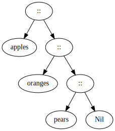
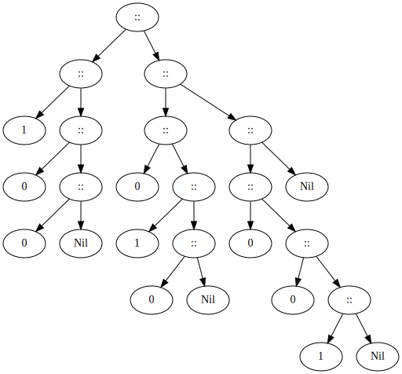
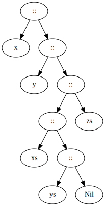

# Decomposition

Suppose you want to write a small interpreter for arithmetic expressions. To keep it simple, lets restrict ourselves to numbers and additions. Expressions can be represented as a _class hierarchy_, with a _base trait_ `Expr` and two _subclasses_ `Number` and `Sum`. To treat an expression, it's neccesssary to know the expression's shape and its components. This brings us to the following _object-oriented_ implementation:
```
trait Expr:
  def isNumber: Boolean     // classification function
  def isSum: Boolean        // classification function
  def numValue: Int         // accessor function
  def leftOp: Expr          // accessor function
  def rightOp: Expr         // accessor function
end Expr

class Number(n: Int) extends Expr:
  def isNumber: true    // classification function
  def isSum: False      // classification function
  def numValue: n
  def leftOp: throw Error("Number.leftOp")
  def rightOp: throw Error("Number.rightOp")
end Number

class Sum(e1: Expr, e2: Expr) extends Expr:
  def isNumber: false   // classification function
  def isSum: true       // classification function
  def numValue: throw Error("Sum.numValue")
  def leftOp: e1        // accessor function
  def rightOp: e2       // accessor function
end Sum
```

You can now write an `evaluation function` as follows:
```
def eval(e: Expr): Int =
  if (e.isNumber) e.numValue   // classification function
  else if (e.isSum) eval(e.leftOp) + eval(e.rightOp)
  else throw Error ("Unknown Expression" + e)
```

`Problem:` Writing all these _classification_ functions (classifying object based on its boolean attributes) and _accessor_ functions (similar to a _get_ method that obtains the data hidden within an object without mutating the data) becomes tedious! It is already tedious for something as an expression with two _subclasses_. It gets more tedious as we add further cases to the expressions.
`Problem:` There's no static guarantee you use the right _accessor_ functions. You might hit an _Error case_ if you are not careful. Many of the functions throw exceptions when they are called, which means you dont have a compile-time guarantee that your program will execute without exceptions being thrown.

__Adding New Forms of Expressions:__

To illustrate the _first problem_, lets study what happens if you want to add new expression forms, say

```
class Prod(e1: Expr, e2: Expr) extends Expr     // e1 * e2
class Var(x: String) extends Expr               // Variable 'x'
```

You need to add methods for classification and access to all classes defined above, and we need to define methods for these two new classes. To integrate _Prod_ and _Var_ into the heirarchy, how many new method definitions do you need ? (including method definitions in _Prod_ and _Var_ themselves, and any new methods that we have to add into _Sum_ and _Number_, but not counting methods that were already given above.) 
To come up with an answer, lets look at the existing classes at first. We need two new methods `isVar` and `isProd` in _trait_ `Expr`, that has to be implemented everywhere. Furthermore, if its a _variable_ of type `Var`, we need a method called `varName` or something like that to get its name, and, we might also _Prod_ `leftOp` and `rightOp` (or reuse them from _Sum_) depending on how far we want to seperate things. So we would need 3 or 5 methods (depending on how we do it) per existing class and either eight or 10 methods for the two new class, because the new class will contain the previous five methods we have implemented as well. So in total, we would need 9 | 15 + 16 | 20 = 25 | 35 methods which is quite a lot. This solution is `not scalable (quadratic explosion)`.

A "hacky" solution could use _type tests_ and _type casts_. Scala let's you do these using methods defined defined in class `Any`:
```
def isInstanceOf[T]: Boolean        // checks whether this object's type conforms to 'T'
def asInstanceOf[T]: T              // treats this object as an instance of type 'T'. Throws 'ClassCastException'
                                    // if it isn't
```
These correspond to Java's _type tests_ and _casts_
        Scala                                       Java

    x.isInstanceOf[T]                           x instanceof T
    x.asInstanceOf[T]                           (T) x


But their use in Scala is discouraged, because there are better alternatives.

__Eval with Type Tests and Type Casts:__

Here's a formulation of the `eval` method using _type tests_ and _casts_:
```
def eval(e: Expr): Int =
  if e.isInstanceOf[Number] e.asInstanceOf[Number].numValue
  else if e.isInstanceOf[Sum] eval(e.asInstanceOf[Sum].leftOp) + eval(e.asInstanceOf[Sum].rightOp)
  else throw Error("Unknown expression" + e)
end eval
```
This is `ugly` and potentially `unsafe`, because we usually don't have a guarantee that a _type cast_ which can throw an _Exception_ is always protected by a _type test_ for the same _Type_. Such mistakes can be easily made in a larger program.

__Solution 1: Object-Oriented Decomposition__

A reasonable solution to the above problem is called `object decomposition`. For example, suppose that all you want to do is evaluate expressions. You could then define:
```
trait Expr:
  def eval: Int
end Expr

class Number(n: Int) extends Expr:
  def eval: Int = n
end Number

class Sum(e1: Expr, e2: Expr) extends Expr:
  def eval: Int = e1.eval + e2.eval
end Sum
```
But what happens if you'd like to `display` expressions now ? You have to define new methods in all the subclasses (a method called something like _show_).


__Assessment of Object-Oriented Decomposition:__

* OO decomposition mixes data with operations on the data
* This can be the right thing if there's a need for _encapsulation_ and _data abstraction_
* On the other hand, it increases complexity(*) and adds new dependencies to classes
* It makes it easy to add new kinds of data but hard to add new kinds of operations. To add a new operation like _show_, we need to touch all the classes that we currently have.

(*) In the literal sense of the word: _complex_ = _plaited, woven together_

Thus, complexity arises from mixing several things together.


__Limitations of Object-Oriented Decomposition:__

OO decomposition only works well if operations are on a `single` object.
What if you want to simplify expressions, say using the rule:

    a * b + a * c       ->      a * ( b + c) 

`Problem:` This is a non-local simplification. It cannot be encapsulated in the method of a single object. You are back to square one; you need _test_ and _access_ methods for all the different subclasses.


# Pattern Matching

__Pattern Matching__ is a _functional_ way to do _OO decomposition_. From the previous `Decomposition section`, the task we are trying to solve is to find a general and convenient way to access heterogeneous data in a _class hierarchy_.

`Attempts seen previously`:
  * _Classification_ and _access_ methods: quadratic explosion
  * _Type tests_ and _casts_: unsafe, low-level
  * _Object-oriented decomposition_: causes coupling between data and operations, need to touch all classes to add a new method

Another solution to the problem is to use `functional decomposition` with `pattern matching`. We can observe that the sole purpose of _test_ and _accessor_ functions is to `reverse` the construction process:
  *  Which _subclass_ was used ?
  *  What were the arguments of the constructor ?

This situation is so common that many functional languages, Scala included, automate it. Scala supports functional decomposition through `case classes`. A __case class definition__ is similar to a normal class definition, except that it is preceded by the modifier case. The compiler automatically creates a '.field_i' _accessor_ for each `field_i` of the case class. For example:
```
trait Expr
case class Number(n: Int) extends Expr
case class Sum(e1: Expr, e2: Expr) extends Expr
``` 
Like before, this defines a _trait_ `Expr`, and two concrete subclasses _Number_ and _Sum_. However, these classes are now empty. So how can we access the members ? through `Pattern Matching` which is a generalization of `switch` from C/Java to class hierarchies. It's expressed in Scala using the keyword `match`.
Example:
```
trait Expr
case class Number(n: Int) extends Expr
case class Sum(e1: Expr, e2: Expr) extends Expr
end Expr

def eval(e: Expr): Int = e match
  case Number(n) => n
  case Sum(e1, e2) => eval(e1) + eval(e2)
end eval
```
Here, `n` is a _reference_ to the value passed to create `e` when `e` is a `Number`. Similarly, `e1` and `e2` are _references_ to the values passed to create `e` when `e` is a `Sum`. Thus, in _pattern matching_, we can access  the arguments of the constructor of object `e` using these _references_.  

__Match Syntax:__

Rules:
  * `match` is preceded by a selector expression and is followed by a sequence of `cases`, _pat_ => _expr_
  * Each case associates an `expression` _expr_ with a `pattern`  _pat_.
  * A _MatchError_ exception is thrown if no pattern matches the value of the selector


_Patterns_ are constructed from:
  *  constructors, _e.g._ _Number, _Sum_
  *  variables, _e.g._ _n_, _e1_, _e2_
  *  _wildcard_ patterns like `_`
  *  constants, _e.g._ 1, true
  *  type tests, _e.g._ n: Number

_variables_ always begin with a lower-case letter. The same _variable_ name can only appear once in a pattern. So, `Sum(x, x`) is `not a legal pattern`. Names of constants begin with a capital letter, with the exception of the reserved words `null`, `true`, `false`.


_Variable patterns_ are often used as fallbacks. For example, in
```
def isNumberMessage(e: Expr): String = e match
  case Number(n) => "This is a number"
  case v => "This is not a number"
```

A _literal pattern_ (constant) matches only if the value is equal to the literal value:

```
def isNumber2(n: Int): Boolean = e match
  case 2 => true
  case _ => false
```
The first case matches only when `n == 2`


Here is a complex pattern:
    
    Sum(Number(n), _)

This pattern is formed from a constructor _Sum_ that gets applied to arguments. The first argument is a constructor _Num_. It gets applied to a _variable_ pattern. The second argument to _Sum_ is a _wildcard_ that can match anything (we don't bother giving it a name because we will not use it further)


__Evaluating Match Expressions:__

An expression of the form

    e match { case p1 => e1 ... case pn => en }

matches the value of the _selector_ `e` with the patterns `p1 ... pn` in the order in which they are written. The whole match expression is rewritten to the right-hand side of the first case where the pattern matches the _selector_ `e`. References to _pattern_ variables are replaced by the corresponding parts in the _selector_.


__What Do Patterns Match?__

  * A constructor _pattern_ `C(p1, ..., pn)` matches all the values of type `C` (or a subtype) that have been constructed with arguments matching the patterns `p1 ... pn`.
  * A variable _pattern_ `x` matches any value, and `binds` the name of the variable to this value. A wildcard _pattern_ matches an value, but does not `bind` any name to that value.
  * A constant _pattern_ `c` matches values that are equal to `c` (in the sense of `==`).
  * A type _pattern_ like `n: Number` will match any value that is of type _Number_ and name it with the name `n`.


Example:

              eval(Sum(Number(1), Number(2)))

    -->       Sum(Number(1), Number(2)) match
                case Number(n) => n
                case Sum(e1, e2) => eval(e1) + eval(e2)

    -->       eval(Number(e1)) + eval(Number(e2))

    -->       Number(1) match
                case Number(n) => n
                case Sum(e1, e2) => eval(e1) + eval(e2)
              + eval(Number(2))

    -->       1 + eval(Number(2))
                                                    (skipping steps)
    -->>      3

__Pattern Matching and Functions:__

Of course, it's also possible to define the evaluation function as a method of the base trait.
Example:
```
trait Expr:
  def eval: Int = this match
    case Number(n) => n
    case Sum(e1, e2) => e1.eval + e2.eval 
``` 

__Exercise:__
Can we write a function _show_ that uses pattern matching to return the representation of a given expression as a string: 
```
def show(e: Expr): String =
```

[Solution](ast.worksheet.sc)


__Second Exercise:__

Add _case_ classes _Var_ for variables `x` and _Prod_ for products `x * y` as discussed previously. Change the _show_ function as that it also deals with products. Pay attention to get _operator precedence_ right, but to use as few parentheses as possible.

Example:

    Sum(Prod(2, Var("x")), Var("y"))

should print as "2 + x + y", But

    Prod(Sum(2, Var("x")), Var("y"))

should print as "(2 + x) * y"

[Solution](ast.worksheet.sc)


# Lists

The __list__ is a fundamental _data structure_ in functional programming. A _list_ having `x1, ..., xn` as elements is written as `List(x1, ..., xn)`. Example:
```
val fruit = List("apples", "oranges", "pears")
val nums  = List(1, 2, 3, 4)
val diag3 = List(List(1, 0, 0), List(0, 1, 0), List(0, 0, 1))
val empty = List()
``` 

There are two important differences between `Lists` and `Arrays`:
  * _Lists_ are _immutable_ - the elements of a _list_ cannot be changed
  * _Lists_ are _recursivE_, while _Arrays_ are flat.

The `fruit` _list_ above can be visualized as follows:



The `::` represents a _cons_ node or _cons-cell_.

The `fruit` _list_ consists of a _cons-cell_ which has a head element called `apples` and a tail which is another _list_. This tail _list_ has a _cons-cell_ with a head element called `oranges` and a tail which is yet another list. This _tail_ list consists of a _cons-cell_ with a head element called `pears` and a tail which is a 'Nil'. _Lists_ are _recursive_ because every _sub-list_ within a _list_ can contains another _list_ or _Nil_.

Similarly, we can visualize the _list_ `diag3`:



The `::` represents a _cons_ node or _cons-cell_.

At the top level, `diag3` has three _cons_ nodes. Each of these _cons_ nodes has a _head_ element that is another _list_ of three numbers.

__Constructors of Lists:__

Like _arrays_, _lists_ are `homogeneous`: the elements of a list must all have the same type. The type of a list with elements of type T is written as `scala.List[T]` or, in the shorter form, just `List[T]`. Example:
```
val fruit: List[String] = List("apples", "oranges", "pears")
val nums: List[Int] = List(1, 2, 3, 4)
val diag3: List[List[Int]] = List(List(1, 0, 0), List(0, 1, 0), List(0, 0, 1))
val empty: List[Nothing] = List()
```

All _lists_ are constructed from:
  *  the empty _list_ `Nil`, and
  *  the construction operation `::` (pronounced _cons_):
        `x :: xs` gives a new _list_ with the first element `x`, followed by elements of `xs`.

For Example:
```
val fruit = "apples" :: ("oranges" :: ("pears" :: Nil))
val nums = 1 :: (2 :: (3 :: (4 :: Nil)))  
val empty = Nil
```

__Right Associativity:__

Convention: Operators ending in `:` associate to the right. `A :: B :: C` is interpretted as `A :: (B :: C)`.
We can thus omit the parantheses in the definition. Example:
```
scala> val nums = 1 :: 2 :: 3 :: 4 :: Nil
val nums: List[Int] = List(1, 2, 3, 4)
```

__Operations on Lists:__

There are three fundamental operations on _Lists_ and all other operations can be expressed in terms of these three operations:
  * `head` - the first element of the _list_
  * `tail` - the _list_ composed of all the elements except the first element
  * `isEmpty` - _true_ if _list_ is empty, _false_ otherwise

These operations are defined as _methods_ of objects of type _List_. For Example:
```
val fruit = "apples" :: "oranges" :: "pears" :: Nil
val nums  = 1 :: 2 :: 3 :: 4 :: Nil  
val diag3 = List(1, 0, 0) :: List(0, 1, 0) :: List(0, 0, 1)
val empty = Nil

fruit.head      == "apples"
fruit.tail.head == "oranges"
diag3.head      == List(1, 0, 0)
empty.head      == throw NoSuchElementException("head of empty list")
```

__List Patterns:__

It is also possible to decompose _lists_ with pattern matching.

    Nil                 The _Nil_ constant
    p :: ps             A pattern that matches any _list_ with a _head_ matching `p` and a _tail_ matching `ps`
    List(p1, ..., pn)   same as `p1 :: ... :: pn :: Nil`

Example:

    1 :: 2 :: xs        matches _Lists_ of _sub-Lists_ that start with `1` and `2`
    x :: Nil            matches _Lists_ of length 1
    List(x)             Same as `x :: Nil`
    List()              matches empty _lists_, same as _Nil_
    List(2 :: xs)       matches _lists_ that contains as only element, another _list_ that starts with `2`

__Exercise:__

Consider the pattern `x :: y :: List(xs, ys) :: zs`.



What is the condition that describes most accurately the length `L` of the _list_ it matches ? Answer: `L >= 3` because `zs` could also be a `Nil` element in which case, the _list_ will have only three elements. The third element is itself a _list_ of two elements.


__Sorting Lists:__

Suppose we want to sort a _list_ of numbers in ascending order:
  * One way to sort the _list_ `List(7, 3, 9, 2)` is to sort the _tail_ `List(3, 9, 2)` to obtain `List(2, 3, 9)`
  * The next step is to insert the head `7` in the right place to obtain the result `List(2, 3, 7, 9)`

This idea describes `Insertion Sort` (simple to implement, but not efficient):
```
def isort(xs: List[Int]): List[Int] = xs match
  case List() => List()
  case y :: ys => insert(y, isort(ys))
```

The definition of _insert_ can be written as:
```
def insert(x: List[Int], xs: List[Int]): List[Int] = xs match
  case List() => List(x)
  case y :: ys => if (x < y) x :: xs else y :: insert(x, ys)    // 'xs' is equal to 'y :: ys'
  // insert each element with one complete recursive call of 'insert' into the List.
```

The `worst-case` complexity of _insertion sort_ relative to the length of the input list `N` is `N * N`.
_Insertion sort_ would go linearly through each element of the _List_: it has one _pattern match_ and one _operation_ per element of the _List_ and each of the _operation_ is an _insert_ call on the remaining _List_. The `first N` comes from the elements of the outer _List_ and the `second N` comes from having to traverse the inner _List_ potentially upto _N_ for the longest and then successively smaller ones. 


# Enums

In the previous sessions, we have learned how to model data with _class hierarchies_. Classes are essentially bundles of functions operating on some common values represented as fields. They are a very useful abstraction, since they allow encapsulation of data. But sometimes, we just need to compose and decompose `pure data` without any associated functions. _Case classes_ and _pattern matching_ work well for this task.

Here's our _case class_ hierarchy for expressions again:
```
trait Expr
object Expr:
  case class Var(s: String) extends Expr
  case class Number(n: Int) extends Expr
  case class Sum(e1: Expr, e2: Expr) extends Expr
  case class Prod(e1: Expr, e2: Expr) extends Expr
```
Pure data definitions like these are called `algebraic data types`, or `ADT's` for short. They are very common in _functional programming_. To make them even more convenient, Scala offers some special syntax.

This time, we have put all _case classes_ in the _Expr_ `companion object`, in order not to pollute the _global namepsace_. So, it's `Expr.Number(1)` instead of `Number(1)`, for example. One can still "pull out" all the cases using an _import_
```
import Expr.*
```

__Enums for Algebraic Data Types(ADTs):__

`Enumerations`(`enums` in short) allow us to represent `ADTs` with less boilerplate code than `traits`. The compiler will translate the `enum` into a class hierarchy. An `enum` enumerates all cases of an Algebraic Data Type(ADT) and nothing else. Example:
```
enum Expr:
  case Var(s: String)
  case Number(n: Int)
  case Sum(e1: Expr, e2: Expr)
  case Prod(e1: Expr, e2: Expr)
```

This _enum_ is equivalent to the case class hierarchy on the previous section, but is shorter, since it avoids the repetitive `class ... extends Expr` notation. _Match_ expressions can be used on enums as usual. For instance, to print expressions with proper parameterization:
```
def show(e: Expr): String = e match
  case Expr.Var(x) => x                   // since the case classes are inside the 'Expr' object, we have to 
  case Expr.Number(n) => n.toString       // prefix them with 'Expr.'
  case Expr.Sum(a, b) => s"${show(a)} + ${show(b)}"
  case Expr.Prod(a, b) => s"${showP(a)} + ${showP(b)}"
end show

// You could also import the 'Expr' object like 'import Expr.*' and use the case classes directly
// like shown in the function below where we use the case class directly since its argument is an `Expr` object.
import Expr.*

def showP(e: Expr): String = e match      
  case e: Sum => s"(${show(expr)})"             // match when e is of type 'Sum'
  case _ => show(expr)                          // match all other cases
```

_Cases_ of _enum_ can also be simple values, without any parameters. 
Example:
Define a _Color_ type with values _Red_, _Green_ and _Blue_:
```
enum Color:
  case Red
  case Green
  case Blue
```
We can also combine several simple cases in one list:
```
enum Color:
  case Red, Green, Blue
```
For _pattern matching_, these simple _cases_ count as _constants_:
```
enum DayOfWeek:
  case Monday, Tuesday, Wednesday, Thursday, Friday, Saturday, Sunday
end DayOfWeek

import DayOfWeek.*

def isWeekend(day: DayOfWeek) = day match
  case Saturday | Sunday => true                  // matches 'Saturday' or 'Sunday' values only for DayOfWeek
  case _ => false                                 // mathes all other days
end isWeekend
```
_Enums/Enumerations_ can `take parameters` and `can define methods`.
Example:
```
enum Direction(val dx: Int, val dy: Int):
  case Right extends Direction(1, 0)
  case Up extends Direction(0, 1)
  case Left extends Direction(-1, 0)
  case Down extends Direction(0, -1)
  def leftTurn = Direction.values((ordinal + 1) % 4)
end Direction
val r = Direction.Right
val u = r.leftTurn        // u = up
val v = (u.dx, u.dy)      // v = (0, 1)
```
Here, `dx` and `dy` are the displacement in the `x` and `y` coordinates respectively. The method `leftTurn` is defined in the _enum_ of type _Direction_ by making use of two _auxiliary_ functional called `ordinal` and `valiues`. The `ordinal` keyword corresponds to the _ordinal number_ of an _enum_ value (that's essentially a number that starts with 0 and goes up by one per _case_ defined in the _enum_). We take the _ordinal number_, add one to it (the _ordinal numbeR_ of the next _case_) and take the remainder of this sum when it is divided by four (since the _Direction_ enum contains four cases, this is a wrap-around to go from _down_ to _right_). This gives us an integer number that can be use in the second method `values`. The `values` method takes an _Int_ and gives us the _enum case_ that has the ordinal number that's given as the end.


__Notes:__

  * _Enumeration cases_ that pass parameters have to use an explicit `extends` clause
  * The expression `e.ordinal` gives the _ordinal value_ of the _enum case_ `e`. _Cases_ start with zero and are numbered consecutively.
  * `values` is an immutable array in the companion object of an _enum_ that contains all _enum_ values.
  * Only simple cases have _ordinal_ numbers and show up in `values`, parameterized cases do not.


The _Direction_ enum is expanded by Scala compiler to roughly the following structure:
```
abstract class Direction(val dx: Int, val dy: Int):
  def leftTurn = Direction.values((ordinal + 1) % 4)
object Direction:
  val Right = new Direction(1, 0) {}    // each value is an instance of an anonymous sub-class called 'Direction' 
  val Up    = new Direction(0, 1) {}    // with the proper values for the parameters
  val Left  = new Direction(-1, 0) {}
  val Down  = new Direction(0, -1) {}
end Direction
```
There are also compiler-defined helper methods `ordinal` in the class and `values` an `valueOf` (which let's you get the _enum case_ that corresponds to string which is the name of the case) in the companion object.


Algebraic Data Types(ADTs) and _enums_ are particularly useful for domain modelling tasks where one needs to define a large number of data types without attaching operations.

Example: Modelling payment methods
```
enum PaymentMethod:
  case CreditCard(kind: Card, holder: String, number: Long, expires: Date)
  case PayPal(email: String)
  case Cash
end PaymentMethod

enum Card:
  case Visa, Mastercard, Amex
end Card
```

We've covered two uses of _enum_ definitions:
  * as a shorthand for hierarchies of _case_ classes
  * as a way to define data types accepting alternative values

The two cases can be combined: an _enum_ can comprise parameterized and simple _cases_ at the same time
_Enums_ are typically used for _pure data_, where all operations on such data are defined elsewhere


# Subtyping and Generics

We've seen the two principal forms of _polymorphism_:
  * `subtyping`
  * `generics`

Here, we will look at their interactions in two main areas:
  * `bounds` of type variables
  * `variance`

Consider the method _assertAllPos_ which
  * takes an _IntSet_
  * returns the _IntSet_ itself if all its elements are positive
  * throws an exception otherwise

what would be the best type you can give to _assertAllPos_ ? Maybe:
```
def assertAllPos(s: IntSet): IntSet
```
In most situations this is fine, but can one be more precise ? One might want to express that _assertAllPos_ takes _Empty_ sets to return _Empty_ sets and _NonEmpty_ sets to return _NonEmpty_ sets. A way to express this is:
```
def assertAllPos[S <: IntSet](r: S): S = ...
```
Here, `<: IntSet` is an `upper bound` of the _parameter_ `S:`. It means that `S` can be instantiated only to types that conform to _IntSet_. Generally, the notation
  * `S <: T` means `S` is a `subtype` of `T`, and
  * `S >: T` means `S` is a `supertype` of `T`, or `T` is a _subtype_ of `S`.

Because the return type is coupled with the parameter type, it expresses that we get out whatever we put in with respect to the type of the parameter. This information was lost in the previous definition of _assertAllPos_ where the return type is always _IntSet_ and not what kind of _IntSet_ (type classes that inherit _IntSet_ for example).

The `lower bound(supertype)` notation can also be used for a _type variable_. Example:
```
[S >: NonEmpty]
```
introduces a type parameter `S` that can range only over `supertypes` of _NonEmpty_ including _NonEmpty_ itself. So `S` could be one of _NonEmpty_, or its _supertypes_ such as _IntSet_, _AnyRef_ or _Any_. 

Similarly
```
[S <: NonEmpty]
```
means that `S` can be any _type_ that is a _subtype_ of _NonEmpty_ including _NonEmpty_ itself.

Finally, it is also possible to mix a lower bound with an upper bound. For instance:
```
[S >: NonEmpty <: IntSet]
```
would restrict `S` to any _type_ on the interval between _NonEmpty_ and _IntSet_. There's another interaction between subtyping and type parameters we need to consider. Given:

    NonEmpty <: IntSet

is 

    List\[NonEmpty\] <: List\[IntSet\] ?

Intuitively, this makes sense: A list of non-empty sets is a special case of a list of arbitrary sets. We call types for which this relationship holds `covariant` because their `subtyping` relationship varies with the type parameter. Does _covariance_ make sense for all _types_, not just for _List_ ? For perspective, let's look at arrays in Java (and C#).
Reminder:
  * An array of `T` elements is written `T[]` in Java
  * In Scala, we use parameterized type syntax `Array[T]` to refer to the same type
  
Arrays in Java are _covariant_, so one would have:

    NonEmpty[] <: IntSet[]

But covariant array typing causes problems. To see why, consider the Java code below:
```
NonEmpty[] a = new NonEmpty[]{
  new NonEmpty(1, new Empty(), new Empty())};
IntSet[] b = a;
b[0] = new Empty();      // This line produces a runtime erroe! a[0] is set to 'new Empty()' since 'b' points to 'a'
NonEmpty s = a[0];
```
It looks like we assigned in the last line an _Empty_ set to a variable of type _NonEmpty_! (a violation of _type_ soundedness - our _type_ system allows us to do something which is clearly wrong. The Java Runtime system patches this security hole by storing a _runtime tag_ in _arrays_ that remember with what _type_ the _array_ was created.) What went wrong ? _Arrays_ can be _covariant_ in Java, but we encounter Runtime Exceptions when we use that.

The following principle, stated by Barbara Liskov (`Liskov's substitution principle`), tells us when a _type_ can be a _subtype_ of another.

    If `A <: B`(`A` is a subtype of `B`), then everything one can do with a value of _type_ `B`, should also be possible with a value of type `A`.

The actual definition Liskov used is a bit more formal. It says:

    Let `q(x)` be a property provable about objects `x` of _type_ `B`. Then, `q(y)` should be provable for objects `y` of _type_ `A` where `A <: B`.

The problematic _array_ example would be written as follows in Scala:
```
abstract class IntSet:
  def incl(x: Int): IntSet
  def contains(x: Int): Boolean
  def union(other: IntSet): IntSet
end IntSet

class NonEmpty(elem: Int, left: IntSet, right: IntSet) extends IntSet:
  def contains(x: Int): Boolean =
    if (x < elem) left.contains(x)
    else if (x > elem) right.contains(x)
    else true
  def incl(x: Int): IntSet =
    if (x < elem) NonEmpty(elem, left.incl(x), right)
    else if (x > elem) NonEmpty(elem, left, right.incl(x))
    else this
  def union(s: IntSet): IntSet = 
    left.union(right).union(s).incl(elem)
end NonEmpty

class Empty() extends IntSet:
  def contains(x: Int): Boolean = false
  def incl(x: Int): IntSet = NonEmpty(x, Empty(), Empty())
  def union(s: IntSet): IntSet = s
end Empty


val a: Array[NonEmpty] = Array(NonEmpty(1, Empty(), Empty()))
val b: Array[IntSet]   = a                                    // Scala will throw a TypeError here
b(0)                   = Empty() // 'b' points to 'a', so, a(0) is set to 'Empty()'
val s: NonEmpty        = a(0)
```
Can an _array_ of _NonEmpty_ `b` be a subtype of of an _array_ of _IntSet_ ? Can everything we do with an _array_ of _type_ _IntSet_ be also done with an _array_ of _type_ _NonEmpty_. If you think about it, there is one thing we can do with an _array_ of _IntSet_ that we cannot do with an _array_ of _NonEmpty_: storing an _Empty_ set is only possible in an _array_ of _IntSet_. Hence, by this logic, _arrays_ cannot be _covariant_ as it violates the `Liskov's substitution principle`. Hence, in Scala, _arrays_ are not _covariant_. The code snippet above throws an error in line 2 whenre an _array_ of _NonEmpty_ `a` is assigned to a variable of type `Array[IntSet]` called `b`. An _array_ of _NonEmpty_ is not a _subtype_ of an _array_ of _IntSet_ in Scala.


# Variance

We have seen that some _types_ should be _covariant_ whereas others should not. Roughly speaking, a _type_ that accepts mutations of its elements should not be _covariant_. But immutable types can be _covariant_, if some conditions on methods are met.

Say `C[T]` is a _parameterized type_ and `A`,`B` are _types_ such that `A <: B`. In general, there are _three_ possible relationships between `C[A]` and `C[B]`:

      C[A] <: C[B]                                                        C is `covariant`
      C[A] >: C[B]                                                        C is `contravariant`
      neither C[A] nor C[B] is a subtype of the other                     C is `nonvariant`

Scala lets you declare the _variance_ of a _type_ by annotating the _type_ parameter:
```
class C[+A] { ... }                                 // C is 'covariant'
class C[-A] { ... }                                 // C is 'contravariant'
class C[A] { ... }                                  // C is 'nonvariant'
```

__Exercise:__

Assume the following _type_ hierarchy and two function _types_:
```
trait Fruit
class Apple extends Fruit
class Orange extends Fruit

type FtoO = Fruit => Orange     // function type declaration
type AtoF = Apple => Fruit      // function type declaration
```
Here, the `type` keyword is used to 

According to the `Liskov's Substitution Principle`, which of the following should be true ?
  1.  FtoO <: AtoF (should _FtoO_ be a _subtype_ of _AtoF_)
  2.  AtoF <: FtoO (should _AtoF_ be a _subtype_ of _FtoO_)
  3.  _FtoO_ and _AtoF_ are unrelated

Lets look at option `1`. You can pass an _Apple_ and obtain a _Fruit_ from the second function _AtoF_. You can do the same thing with the first function _AtoO_. You can pass an _Apple_ (since _Apple_ inherits _Fruit_) to _FtoO_ and abtain an _Orange_ (which also inherits _Fruit_). However, for option `2` _AtoF_ cannot be a _subtype_ of _FtoO_ because you can pass an _Orange_ to _FtoO_ but cannot pass an _Orange_ to _AtoF_. Furhtermore, _AtoF_ returns a _Fruit_ (could be _Apple_ or _Orange_) which is a less precise _type_ compared to _Orange_ from _FtoO_. So, the correct answer is option `1` - _FtoO_ is a _subtype_ of _AtoF_.

__Typing Rules for Functions:__
Generally, we have the following rule for _subtyping_ between _function types_:
  
    if `A2 <: A1` and `B1 <: B2`, then `A1 => B1 <: A2 => B2`

So functions are `contravariant` in their argument type(s) and `covariant` in their result type(s). This leads to the following revised definition of the _Function1_ trait:
```
package scala
trait Function1[-T, +U]:  // functions are contravariant in their argument type 'T' and covariant in their result
  def apply(x: T): U      // type 'U'
```

__Variance Checks:__

We have seen in the _array_ example that the combination of _covariance_ with certain operations is unsound. In this case the problematic operation was the update operation on an _array_. If we turn _Array_ into a class, and update into a method, it would look like this:
```
class Array[+T]:
  def update(x: T) = ...
```

The problematic combination is
  * The _covariant type_ parameter `T`
  * which appears in parameter position of the method _update_

The Scala compiler will check that there are no problematic combinations when compiling a class with variance annotations. Roughly
  * _covariant_ type parameters can only appear in method results
  * _contravariant_ type parameters can only appear in method parameters
  * _invariant_/_nonvariant_ type parameters can appear anywhere

The precise rules are a bit more involved, fortunately Scala compiler performs them on for us.

Let's have a look at _Function1_:
```
trait Function[-T, +U]:
  def apply(x: T): U
```
Here,
  * `T` is _contravariant_ and appears only as a method parameter type
  * `U` is _covariant_ and appears only as a method result type

So the method check out correctly.


__Variance and Lists:__

Let's get back to the previous implementation of lists. One shortcoming was that _Nil_ had to be a class, whereas we would prefer it to be an object (after all, there is only one empty list). Can we change that ? Yes, because we can make _List_ covariant. Here are the essential modifications:
```
trait List[+T]
  ...
object Empty extends List[Nothing]
  ...
```
Here, `Nothing <: T` (`Nothing` is a _subtype_ of `T`)


__Idealized Lists:__

Here is a definition of list that implements all cases we have seen so far:
```
trait List[+T]:
  def isEmpty = this match
    case Nil => true
    case _ => false
  override def toString =
    // local function called 'recur'
    def recur(prefix: String, xs: List[T]): String = xs match
    // if the second argument which is a List called 'xs' is non-empty, print the prefix, the head
    // element and follow with a recursive call to 'recur' where you print the subsequent elements seperated by ","
      case x :: xs1 => s"${prefix}${x}${recur(",", xs1)}"
      case Nil => ")"     // if the second argument which is a List called 'xs' is empty, close the string with ")"
    recur("List(", this)

case class ::[+T](head: T, tail: List[T]) extends List[T]     // A sub-class ::(CONS) of List[T]
case object Nil extends List[Nothing]                         // A sub-object of Lists

extension [T](x: T) def :: (xs: List[T]): List[T] = ::(x, xs)   // ::(CONS) as an infix method

// Overloaded 'apply' method with several cases to create a List
object List:
  def apply() = Nil
  def apply[T](x: T) = x :: Nil
  def apply[T](x1: T, x2: T) = x1 :: x2 :: Nil
```

Sometimes we need to put in a bit of work to make a class _covariant_. Consider adding a _prepend_ method to _List_ which prepends a given element, yielding a new list. 
A first implementation of prepend could look like this:
```
trait List[+T]:
  def prepend(elem: T): List[T] = ::(elem, this)
```
But that does not work!


__Exercise:__

Why does the following code not type-check ?
```
trait List[+T]
  def prepend(elem: T): List[T] = ::(elem, this)
```
_prepend_ gives a new _Cons_ node, so there is no mutation involved. It doesn't turn _List_ into a mutable class. _prepend_ fails _variance_ checking because the type parameter `T` is used as the parameter of the _prepend_ method and we have seen that's legal only for _contravariant_ type parameters or _invariant_ type parameters, but `T` is declared _covariant_. So, it's a _variance_ error.

Indeed, the compiler is right to throw out _List_ with _prepend_, because it violates the `Liskov Substitution Principle`:
Here's something one can do with a list `xs` of type `List[Fruit]`:
```
xs.prepend()
```
But the same operation on a list `ys` of type `List[Apple]` would lead to a type error:
```
ys.prepend(Orange) // type mismatch, required: Apple, found: Orange
```
So, `List[Apple]` cannot be a _subtype_ of `List[Fruit]`. But _prepend_ is a natural method to have on immutable lists! How can we make it _variance-correct_ ? We can use a _lower bound_:
```
def prepend[U >: T](elem: U): List[U] = ::(elem, this)
```
this passes _variance_ checks, because:
  * _covariant_ type parameters may appear in _lower bounds_ of method type parameters
  * _contravariant_ type parameters may appear in _upper bounds_

So, in essence, we have a double flip. We go to a parameter and then to the _lower bound_ of that parameter. This turns _variance_ around again and makes _covariant_ parameters legal to appear. Is this more than a trick to make the _variance_ checker happy ? Assume _prepend_ is implemented like this:
```
def prepend [U >: T](elem: U): List[U] = ::(elem, this)
```
What is the result type of this function:
```
def f(xs: List[Apple], x: Orange) = xs.prepend(x) ?
```
We would get a `List[Fruit]`. We get an element of type `Orange` into the list `List[Apples]` and the compiler will have to find a type `U` which is a _supertype_ of `Apple` and can also take an `Orange`. The smallest such type is `Fruit` and hence, the compiler will instantiate type `U` with `Fruit` and so, we get `List[Fruit]` as the result. There's a simpler way to obtain the same functionality using _extension methods_. The need for a _lower bound_ was essentially to decouple the new parameter of the class and the parameter of the newly created object (such as `Fruit` in our case of `List[Apple]`). Using an _extension method_ such as in `::` above, sidesteps the problem and is often simpler:
```
extension[T](x: T):
  def ::(xs: List[T]): List[T] = ::(x, xs)
```
Here, the compiler will instantiate the type `T` to be a _supertype_ of the type of the element that we _prepend_ and the type of the tail that we pass. So, if we _prepend_ an `Orange` to a `List[Apples]`, we would again obtain a `List[Fruit]`.