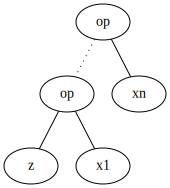
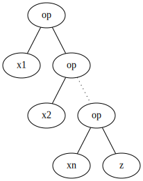
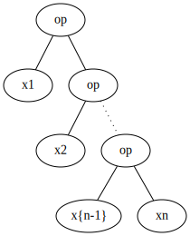
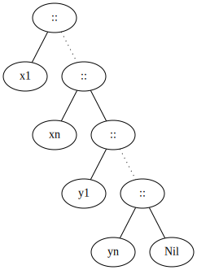
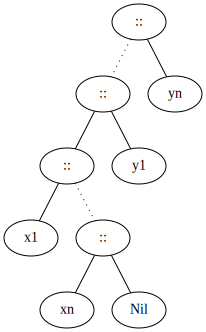
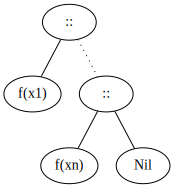

# A Closer Look at Lists

_Lists_ are the core data structure that we work with most often. _Lists_ have a rich catalogue of operations.

        Type:               List[Fruit]

        Construction:
                val fruits = List("Apple", "Orange", "Banana")
                val nums = 1 :: 2 :: Nil
        Decomposition:
                fruits.head    //  "Apple"
                nums.tail      // Nil
                nums.isEmpty   // false

                nums match 
                  case x :: y :: _ => x + y    // 3


`Sublists and element access:`

                xs.length               The number of elements of 'xs'

                xs.last                 The list's last element, exception if 'xs' is empty.

                xs.init                 A list consisting of all elements of 'xs' except the last one, exception 
                                        if 'xs' is empty. (does the opposite of `xs.tail`)

                xs.take(n)              A list consisting of the first 'n' elements of 'xs' (elements upto 'n'), or
                                        'xs' itself if it is shorter than 'n'. It does not include the element at
                                        index 'n' in 'xs'.

                xs.drop(n)              The rest of the collection after taking 'n' elements. It returns 'Nothing'
                                        if the list is exhausted before reaching the 'n'th element. It includes the 
                                        element at index 'n' in 'xs'.

                xs(n)                   (or, written out, `xs.apply(n)` since lists are similar to functions in
                                        Scala). The element of 'xs' at index 'n'. It returns an exception if the
                                        index 'n' is out of range of the size of the list.
                

`Creating new Lists:`


                xs ++ ys                The list consisting of all elements of 'xs' followed by all elements of 'ys'
                                        (list concatenation)

                xs.reverse              The list containing elements of 'xs' in reverse order

                xs.updated(n, x)        The list containing the same elements as 'xs', except at index 'n' where it
                                        contains 'x'


`Finding elements:`

                xs.indexOf(x)           The index of the first element in 'xs' equal to 'x', or '-1' if the element 
                                        'x' does not appear in 'xs'
                
                xs.contains(x)          Same as `xs.indexOf(x) >= 0`. It returns 'true' if 'x' is found in 'xs' or 
                                        'false' if 'x' is not found in 'xs'


Let's take a look at how some of these _List methods_ are implemented.

The complexity of `head` is (small) constant time - because it just pulls out one of the fields of a _Cons_ node. What is the complexity of `last` ? To find out, let's write a possible implementation of the method `last` as a stand-alone function:
```
def last[T](xs: List[T]): T = xs match
  case List() => throw Error("last of empty list")
  case List(x) => x
  case y :: ys => Last(ys)
```
So, `last` takes steps proportional to the `length` of the _List_ `xs` - we need to _iterate_ over all the elements of the _List_ once. Therefore, the complexity is linear in the _size_ of the _List_. This makes `last` as lot less effecient than `head`. Hence, it is recommended to define your operations on _Lists_ using `head` and `tail` if possible, instead of using `last` and `init`.


Implementing `init` as an external function, analogous to `last`:
```
def init[T](xs: List[T]): List[T] = xs match
  case List() => throw Error("init of empty list")
  case List(x) => List()
  case y :: ys => y :: init(ys)
```
Just like `last`, `init's` complexity is also proportional to the `length` of the argument list `xs`


How can _List_ concatenation (`concat` method) be implemented ? Let's try by writing an _extension method_ for `++`
```
extension [T](xs: List[T]) = 
  def ++ (ys: List[T]): List[T] = xs match
    case Nil => ys
    case x :: xs1 => x :: (xs1 ++ ys)
```
What is the complexity of `concat` ? `O(xs.length)` as we do pattern matching only on the left list `xs`, and go to the end of that list.


How can `reverse` be implemented ? Let's try by writing an extension method:
```
extension [T](xs: List[T]) =
  def reverse: List[T] = xs match
    case Nil => Nil
    case y :: ys => ys.reverse ++ List(y) 
```
What is the complexity of `reverse` ? `O(xs.length * xs.length)` - This _quadratic_ complexity is because, we go through every element of the list `xs`, that gives us a factor linear in the length of the list and then for each of the sub-lists we call the `concat/++` method which is itself proportional in complexity to the length of the list.

`Can we do better ?` (to be solved later).


__Exercise:__

Remove the `n'th` element of a list `xs`. If `n` is out of bounds, return `xs` itself.
```
def removeAt[T](n: Int, xs: List[T]): List[T] = ??? 
```
Usage example:
```
removeAt(1, list('a', 'b', 'c', 'd')) // List(a,c,d)
```
[Solution](Lists2.worksheet.sc)


__Another Exercise:__

Flatten a list structure:

```
def flatten(xs: List[Any]): List[Any] = ???

flatten(List(List(1, 1), 2, List(3, List(5, 8)))) // res0: List[Any] = List(1, 1, 2, 3, 5, 8)
```
[Solution](Lists2.worksheet.sc)


# Tuples and Generic Methods

__Sorting Lists Faster:__

As a non-trivial example, let's design a function to sort lists that is more efficient than _insertion sort_.
A good algorithm for this is `merge sort`. The idea is as follows:

        If the list consists of zero or one elements, it is already sorted.
        
        Otherwise,
          *  Seperate the list into two sub-lists, each containing around half of the elements of the original list
          *  Sort the two sub-lists
          *  Merge the two sorted sub-lists into a single sorted list


Here is an outline of the implementation of `merge sort` in Scala:
```
def msort(xs: List[Int]): List[Int] =
  val n = xs.length / 2
  if (n == 0) xs
  else
    def merge(xs: List[Int], ys: List[Int]) = ???
    val (fst, snd) = xs.splitAt(n)
    merge(msort(fst), msort(snd))
```
The `splitAt` methods on _ListS_ returns two _sublists_
  * One _sublist_ contains the elements up to the given index
  * The other _sublist_ contains all elements starting from the element at that index

The _sublists_ are returned in a `pair`. 


__Detour: Pairs and Tuples__

A `pair` consisting of `x` and `y` is written `(x, y)` in Scala.

Example:
```
val pair = ("answer", 42)  // pair: (String, Int) = (answer, 42)
```
The type of _pair_ above is `(String, Int)`. Pairs can also be used in patterns for matching:
```
val (label, value) = pair // label: String = answer, value: Int = 42
```
This works analogously for `Tuples` with more than two elements - You can have as many _parts_ in a `pair` as you want. A `pair` is a `Tuple` with two elements (of type `Tuple2`). Similarly, you can have types like `Tuple3`, `Tuple4`, `Tuple10` depending on the number of elements in the tuple.

Using `pairs`, we can write the _extension method_ `splitAt` like:
```
extension [T](xs: List[T])
    def splitAt(n: Int) = (xs.take(n), xs.drop(n))
```
as seen in [Solution](Lists2.worksheet.sc).


So far, every _type_ we saw in Scala has been an instance of some _Class_ and the same holds true for `Tuples`. For smallish `n (number of elements)` (`*`), the `tuple` _type_ `(T1, ..., Tn)` is an abbreviation of the _parameterized type_
                
                scala.Tuple`n`\[T1, ..., Tn\]     // A pair (Int, String) would be abbreviated as: 
                                                  // Tuple2[Int, String]

A _Tuple_ expression `(e1, ..., en)` is equivalent to the function application
                
                scala.Tuple`n`(e1, ..., en)

A _Tuple_ pattern `(p1, ..., pn)` is equivalent to the constructor pattern

                scala.Tuple`n`(p1, ..., pn)

(`*`) Currently, "smallish" = up to 22. There's also a `TupleXXL` class that handles _Tuples_ larger than that limit.

`The Tuple Class:`

Here, all _Tuplen_ clases are modeled after the following pattern:
```
case class Tuple2[T1, T2](_1: +T1, _2: +T2):
  override def toString = "(" + _1 + "," + _2 + ")"
```
The fields / elements of a _Tuple_ can be accessed with names / selectors `_1` and `_2`, ...
So, instead of the pattern binding
```
val (label, value) = pair
```
one could also have written:
```
val label = pair._1
val value = pair._2
```
But, the _pattern matching_ form is generally preferred. The individual element selectors can sometimes be useful if you have a long _Tuple_ and you just want to select a single element.


Now, let's define the `merge` function for `msort` as follows:
```
def merge(xs: List[Int], ys: List[Int]) = (xs, ys) match   // pattern match on the argument pair (xs, ys)
  case (Nil, ys) => ys          // first list argument is Nil and second list argument is 'ys'
  case (xs, Nil) => xs
  case (x: xs1, y: ys1) => if (x < y) x :: merge(xs1, ys) else y :: merge(xs, ys1)  // when both argument lists are 
                                                                                    // non-empty
```

`Problem:` How to parameterize `msort` so that it can also be used for lists with elements other than _Int_ ?
```
def msort[T](xs: List[T]): List[T] = ???
```
does not work, because the comparison operator `<` used in last _match case_ of the `merge` function is not defined for _arbitrary types_ `T` (not defined for types other than _Int_).

`Idea:` Parameterize merge with the neccessary _comparison function_. The most flexible design is to make the function `msort` polymotphic, and to pass the comparison operation as an additional parameter:
```
def msort[T](xs: List[T])(lt: (T, T) => Boolean) =
  val n = xs.length / 2
  if (n == 0) xs
  else
    def merge(xs: List[Int], ys: List[Int]) = ???
    val (fst, snd) = xs.splitAt(n)
    merge(msort(fst)(lt), msort(snd)(lt))
```
`merge` then needs to be adapted as follows:
```
def merge[T](xs: List[T], ys: List[T]) = (xs, ys) match
  case (Nil, ys) => ys
  case (xs, Nil) => xs
  case (x :: xs1, y :: ys1) => if(lt(x, y)) x :: merge(xs1, ys) else y :: merge(xs, ys1)
```

We can now call `msort` as follows:
```
val xs = List(-5, 6, 3, 2, 7)
val fruits = List("apple", "pear", "orange", "pineapple")

msort(xs)((x: Int, y: Int) => x < y)
msort(fruits)(x: String, y: String) => x.compareTo(y) < 0) // comparison of two strings - returns 0 if both strings 
                                                           // are equal or a positive number if string1 value is 
                                                           // greater than string2 value
```
or since _parameter types_ can be inferred from the call `msort(xs)` (Note that we don't use `msort[Int](xs)` or `msort[String](fruits)` because the compiler can infer the _type arguments_ from the types of the arguments):
```
msort(xs)((x, y) => x < y)
```
The `compareTo()` method in Scala is used to compare two _Strings_ in Scala and return an integer value denoting the difference (this method is also part of Java).
The value of comparison is determined as:
  * `0`, if both strings are the same.
  * `x`, if string1 is greater than string2. The value of x is denoted by the difference of value of characters.
  * `-x`, if string1 is smaller than string2. The value of x is denoted by the difference of value of characters.


We can make the compiler infer not just the types, but also the comparison function to be used for a particular _parameter type_. Here, the compiler will infer a _value_ (a comparison function for _Int_ or _String_) for the _parameter type_. This is possible with the use of `implicit parameters` which we will see later.


# Higher-Order List Functions

_Higher-Order_ functions can be very useful, particularly for _Lists_, where there are many very common operations that can be abbreviated with _higher-order_ functions. The examples of _List_ methods we've seen have already shown that functions on _Lists_ have quite similar structures. We can identify several recurring patterns, like:
  *  transforming each element in a _List_ in a certain way
  *  retrieving a _List_ of all elements satisfying a criterion
  *  combining the elements of a _List_ using an operator

Functional languages allow programmers to write _generic_ functions that implement patterns such as these using `higher-order functions`.

A common operation is to transform each element of a _List_ and then return the _List_ of results. For example, to multiply each element of a _List_ by the same factor, you could write:
```
def scaleList(xs: List[Double], factor: Double): List[Double] = xs match
  case Nil => xs
  case y :: ys => y * factor :: scaleList(ys, factor)
``` 


__Mapping:__

This scheme can be generalized to the method `map` of a _List_ class. A simple way to define `map` is as follows:
```
extension [T](xs: List[T])
  def map[U](f: T => U): List[U] = xs match
    case Nil => xs
    case x :: xs => f(x) :: xs.map(f)
```
(in fact, the actual definition of `map` is a bit more complicated, because it is _tail-recursive_, and also because it works for arbitrary collections, not just _Lists_).

Using `map`, _scaleList_ can be written more concisely
```
def scaleList(xs: List[Double], factor: Double): List[Double] = 
  xs.map(x => x * factor)
```


__Exercise:__

Consider a function to square each element of a _List_, and return the result. Two equivalent definitions of _squareList_ are:
```
def squareLists(xs: List[Int]): List[Int] = xs match
  case Nil => xs
  case y :: ys => y * y :: squareList(ys)

def squareList(xs: List[Int]): List[Int] =
  xs.map(x => x * x)
```


__Filtering:__

Another common operation on _Lists_ is the selection of all elements satisfying a given condition. For example:
```
// A function to take positive elements of a List[Int]
def posElems(xs: List[Int]): List[Int] = xs match
  case Nil => xs
  case y :: ys => if (y > 0) y :: posElems(ys) else posElems(ys)
```
This pattern is generalized by the method `filter` of the _List_ class:
```
extension [T](xs: List[T])
  def fiter(p: T => Boolean): List[T] = xs match
    case Nil => xs
    case x :: xs => if (p(y)) x :: xs.filter(p) else xs.filter(p)
```
Using `filter`, _posElems_ can be written more concisely:
```
def posElems(xs: List[Int]): List[Int] = 
  xs.filter(x => x > 0)
```

Besides `filter`, there are also the following methods that extract sublists based on a _predicate_:
                
                xs.filterNot(p)                 Same as `xs.filter(x => !p(x))`; The list consisting
                                                of those elements of 'xs' that donot satisfy the 
                                                predicate 'p'.
                
                xs.partition(p)                 Same as `(xs.filter(p), xs.filterNot(p))`, but computed
                                                in a single traversal of the list 'xs'. It retuns a pair of
                                                lists where the first list contains elements of 'xs' that 
                                                satisfy 'p' and the second list contains elements of 'xs'
                                                that donot satisfy 'p'. This is more efficient than two seperate
                                                calls to `xs.filter(p)` and `xs.filterNot(p)`.

                xs.takeWhile(p)                 The longest prefix of list 'xs' consisting of elements 
                                                that all satisfy the predicate 'p'. The first element of 'xs'
                                                that does not satisfy 'p' terminates the output.

                xs.dropWhile(p)                 The remainder of list 'xs' after any leading elements
                                                satisfying the predicate 'p' have been removed. We drop
                                                elements of 'xs' until we reach an element that does not
                                                satisfy 'p' and return this list. We drop the longest prefix
                                                of list elements that do satisfy 'p' from 'xs'. 

                xs.span(p)                      Same as `(xs.takeWhile(p), xs.dropWhile(p))`, but computed
                                                in a single traversal of the list 'xs'.
                


[Difference between Partition and Span](lists2.worksheet.sc)


__Exercise:__

Wrie a function _pack_ that packs consecutive duplicates of list elements into sublists. For instance,
```
pack(List("a", "a", "a", "b", "c", "c", "a"))
```
should give
```
List(List("a", "a", "a"), List("b"), List("c", "c"), List("a"))
```
You can use the following template:
```
def pack[T](xs: List[T]): List[List[T]] = xs match
  case Nil      => ???
  case x :: xs1 => ???
```
Answer: [Solution](Lists2.worksheet.sc)


__Another Exercise:__

Using _pack_, weite a function _encode_ that produces the run-length encoding of a list. The idea is to encode `n` consecutive duplicates of an element `x` as a pair (x, n). For instance:
```
encode(List("a", "a", "a", "b", "c", "c", "a"))
```
should give
```
List(List("a", 3), List("b", 1), List("c", 2), List("a", 1))
```
Outline:
```
def encode[T](xs: List[T]): List[(T, Int)] = ???
```

[Solution](Lists2.worksheet.sc)


# Reduction of Lists

Another common operation on _Lists_ is to combine elements of a _List_ using a given _operator_. For example:

        sum(List(x1, ..., xn))          =       0 + x1 + ... + xn
        product(List(x1, ..., xn))      =       1 * x1 * ... * xn

We can implement this using the usual recursive schema:
```
def sum(xs: List[Int]): List[Int] = xs match
  case Nil => 0
  case y :: ys => y + sum(ys)
```

This pattern can be abstracted out using the generic method `reduceLeft` which inserts a given binary operator between adjacent elements of a _List_:

                List(x1, ..., xn).reduceLeft(op)       = x1.op(x2). ... .op(xn)

Using `reduceLeft`, we can simplify:
```
def sum(xs: List[Int])     = (0 :: xs).reduceLeft((x, y) => x + y)
def product(xs: List[Int]) = (1 :: xs).reduceLeft((x, y) => x * y)
```


__A Shorter Way to Write Functions:__

Instead of `((x, y) = x * y)`, one can also write shorter: `(_ * _)`, where every `_` represents a new parameter, going from left to right. The parameters are defined at the next outer pair of parentheses (or the whole expression if there are no enclosing parantheses). 

So, _sum_ and _product_ can also be expressed like this:
```
def sum(xs: List[Int])     = (0 :: xs).reduceLeft(_ + _)
def product(xs: List[Int]) = (1 :: xs).reduceLeft(_ * _)
```

The function `reduceLeft` is defined in terms of a more general function, `foldLeft`. `foldLeft` is just like `reduceLeft`, but it takes an `accumulator` (`z`), as an additional parameter, which is returned when `foldLeft` is called on an empty list.

                List(x1, ..., xn).foldLeft(z)(op) = z.op(x1).op ... .op(xn)


The `foldLeft` usage above will visually look like this:



It is a left-leaning tree with operations `op` at each node and `z` at the lower left corner. The elements `x1 ... xn` are the right-side leaves of each operation node.


So, _sum_ and _product_ can also be defined as follows:
```
def sum(xs: List[Int])     = xs.foldLeft(0)(_ + _)
def product(xs: List[Int]) = xs.foldLeft(1)(_ * _)
```

`foldLeft` and `reduceLeft` can be implemented in class _List_ as follows:
```
abstract class List[T]:
  def reduceLeft(op: (T, T) => T): T = this.match       // Here, 'this' points to the List instance itself
    case Nil     => throw illegalOperationException("Nil.reduceLeft")
    case x :: xs => xs.foldLeft(x)(op)

  def foldLeft[U](z: U)(op: (U, T) => U): U = this.match    // Here, 'this' points to the List instance itself
    case Nil     => z
    case x :: xs => xs.foldLeft(op(z, x))(op)
```

Applications of `foldLeft` and `reduceLeft` unfold on trees that lean to the left. They have dual functions, `foldRight` and `reduceRight`, which produce trees that lean to the right, ie,

                List(x1, ..., x{n-1}, xn).reduceRight(op) = x1.op(x2.op(... x{n-1}.op(xn) ...
                List(x1, ..., xn).foldRight(z)(op)        = x1.op(x2.op(... xn.op(z) ...))

The primary difference between `foldLeft` and `foldRight` is the order in which the fold operation iterates through the collection in question. `foldLeft` starts on the left side—the first item—and iterates to the right; foldRight starts on the right side—the last item—and iterates to the left (in both the folds the type of the start value must be the same as the return value). The first constraint is that the start value must be a supertype of the object you're folding. In our first example we were folding on a type `List[Int]` and had a start type of `Int`. `Int` is a supertype of `List[Int]`. The second constraint of folds is that the start value must be neutral, i.e. it must not change the result. For example, the neutral value for an addition operation would be 0, 1 for multiplication, Nil lists, etc.


                List(1, 2, 3).foldLeft(0)(_ + _)
                // ((0 + 1) + 2) + 3
                // = 6
                
                List(1, 2, 3).foldRight(0)(_ + _)
                // 1 + (2 + (3 + 0))
                // = 6


Visually, `foldRight` would look like this:



The spine of the tree are the `op` operations again, the elements `x1 ... xn` appear from top to bottom and `z` (0 for _sum_ and 1 for _product_) appears in the lower right corner. Similarly, `reduceRight` will look like this:




`foldRight` and `reduceRight` can be defined as follows:
```
def reduceRight(op: (T, T) => T): T = this match
  case Nil => throw illegalOperationException("Nil.reduceRight")
  case x :: Nil => x
  case x :: xs => op(x, xs.reduceRight(op))


def foldRight[U](z: U)(op: (T, U) => U): U = this match
  case Nil     => z
  case x :: xs => op(x, xs.foldRight(z)(op))
```

For operators (`op`) that are _associative_ and _commutative_, `foldLeft` and `foldRight` are equivalent (even though there may be a difference in efficiency - often `foldLeft` can be implemented in a _tail recursive_ way whereas `folRight` is not _tail recursive_ and would require more stack space). But sometimes, only one of the two methods is appropriate.


__Exercise:__

Here is another formulation of _concat_:
```
def concat[T](xs: List[T], ys: List[T]): List[T] =
  xs.foldRight(ys)(_ :: _)
```
We can visualize this version of _concat_:



Here, it isn't possible to replace `foldRight` with `foldLeft`. Why ? The types would not work out. If we do a `xs.foldLeft(ys)(_ :: _)`, then we would have a _List_ like this:



This wont be type compatible with `xs.foldRight(ys)(_ :: _)` because, here we are mixing a _List_ (x1 ... xn, Nil) with single elements (y1 ... yn). (Note that Nil is present only in the `xs` List). So, `xs.foldLeft(ys)(_ :: _)` and `xs.foldRight(ys)(_ :: _)` won't have the same type and that's why it won't work out.


We can now develop a function for reversing _Lists_ which has a linear cost compared to the quadratic cost that we had in our [previous implementation](#a-closer-look-at-lists) Closer Look at Lists). The idea is to use the operation `foldLeft`:
```
def reverse[T](xs: List[T]): List[T] = xs.foldLeft(z?)(op?)
```
All that remains is to relplace the parts `z?` and `op?`. We can `compute` them from examples. To start computing `z?`, let's consider reverse(Nil). We know `reverse(Nil) == Nil`, so we compute as follows:

                Nil

                = reverse(Nil)

                = Nil.foldLeft(z?)(op)

                = z?


Consequently, `z? = Nil`. 
We still need to compute `op?`. To do that, lets plug in the next simplest _List_ after _Nil_ into our equation for `reverse`:

                List(x)

                = reverse(List(x))      // reversing a singleton gives the list itself

                = List(x).foldLeft(Nil)(op?)

                = op?(Nil, x)


Consequently, `op?(Nil, x) = List(x) = x :: Nil`. This suggests to take for `op?`, the operator `::` but with its operands swapped. Thus, we arrive at the following implementation of `reverse`:
```
def reverse[T](xs: List[T]): List[T] = 
  xs.foldLeft(List[T]())((xs, x) => xs :: x)
```
`Remark:` The type parameter in `List[T]()` is necessary for _type inference_ in Scala. The complexity of this implementation of `reverse` is Linear in list `xs` instead of Quadratic.


__Exercise:__

Complete the following definitions of the basic functions `map` and `length` on lists, such that their implementation uses `foldRight`:
```
// Get an element and the remainder of the list, apply operation to the element, and do a 'cons' with the remaining
// list
def mapFun[T, U](xs: List[T], f: T => U): List[U] =
  xs.foldRight(List[U]())( (y, ys) => f(y) :: ys )

// The operation here takes a list element and the length that was computed so far, on the right as (y, n), and just
// returns the length plus 1. The element and the contents of the element are ignored.
def lengthFun[T](xs: List[T]): Int = 
  xs.foldRight(0)( (y, n) => n + 1 )
```

Visually, the `map` function when applied will look like this:




# Reasoning about Lists

Recall the concatenation operation `++` on _Lists_. We would like to verify that concatenation is _associative_, and that it admits the empty _List_ `Nil` as neutral element to the left and to the right:

                (xs ++ ys) ++ zs = xs ++ (ys ++ zs)     // associativity

                xs ++ Nil        = xs                   // admits Nil to the right

                Nil ++ xs        = xs                   // admits Nil to the left
  
How can we prove properties like these ? By using `structural induction` on _Lists_. Let's first take a step back and have a look at the principle of proof by `natural induction`:  

To show a property `P(n)` for all integers `n >= b`,
  *  Show that we have `P(b)` (`base case`) (show that `P(b)` holds)
  *  For all integers `n >= b`, show the `induction step`:
   
                    if one has `P(n)`, then one also has `P(n + 1)`

__Example:__

Given:
```
def factorial(n: Int): Int = 
  if (n == 0) 1                 // 1st clause
  else n * factorial(n - 1)     // 2nd clause
```
Show that for all `n >= 4`

                factorial(n) >= power(2, n)


__Base Case: 4__

This case is established by simple calculations:
        
                factorial(4) which is 24 >= 16 which is power(2, 4)


__Induction step: n + 1__

We have for `n >= 4`:

                factorial(n + 1)

                >= (n + 1) * factorial(n)               // by 2nd clause in factorial
 
                > 2 * factorial(n)                      // by calculating that (n + 1) is atleast 5

                >= 2 * power(2, n)                      // by induction hypothesis (factorial(n) >= power(2, n))

                = power(2, n + 1)                       // by definition of power


In these proofs, we have freely applied reduction steps as equalities to some part of a term - we have replaced the left hand side of a function with its right hand side or _vice versa_. That works because pure functional programs don't have _side effects_; so that a term is equivalent to the term to which it reduces (a function left hand side is equivalent to its right hand side). This principle is called `referential transparency` and it is the basis that makes such proof systems work.


The principle of `structural induction` is analogous to `natural induction`:

To prove a property `P(xs)` holds (`base case`):
  * show that `P(Nil)` holds (`base case`)
  * for a list `xs` and some element `x`, show the `induction step`:
          
                  if `P(xs)` holds, then `P(x :: xs)` also holds


__Example:__

Let's show that for lists `xs`, `ys` and `zs`:

                  (xs ++ ys) ++ zs  =  xs ++ (ys ++ zs)


To do this, use `structural induction` on `xs`. From the previous implementation of `++`,

```
extension [T](xs: List[T])
  def ++ (ys: List[T], zs: List[T]) = xs match
    case Nil      => ys
    case x :: xs1 => x :: (xs1 ++ ys)
```
distill two _defining clauses_ of `++`:

                    Nil ++ ys = ys                     // 1st clause
              (x :: xs1) ++ ys = x :: (xs1 ++ ys)      // 2nd clause


__Base Case: Nil__

For the left-hand side we have:

                    (Nil ++ ys) ++ ys

                    = ys ++ zs                        // by 1st clause of ++

for the right-hand side we have:

                    Nil ++ (ys ++ zs)

                    = ys ++ zs                        // by the 1st caluse of ++

This case is therefore established.


__Induction Step: x :: xs__

For the left-hand side, we have:

                    ((x :: xs) ++ ys) ++ zs

                    = (x :: (xs ++ ys)) ++ zs         // by the 2nd clasue of ++

                    = x :: ((xs ++ ys) ++ zs)         // by the 2nd clause of ++

                    = x :: (xs ++ (ys :: zs))         // by induction hypothesis ((xs ++ ys) ++ zs  =  xs ++ (ys ++ zs))

For the right-hand side, we have:

                    (x :: xs) ++ (ys ++ zs)

                    = x :: (xs ++ (ys ++ zs))         // by the 2nd clause of ++

                    = LHS

So this case (and with it, the property) is established.


__Exercise:__

Show by induction on `xs` that `xs ++ Nil = xs`.

How many equations do you need for the `inductive step` ? 

                      (x :: xs) ++ Nil

                      = x :: (xs ++ Nil)               // by the 2nd clause of ++

                      = x :: xs                        // by induction hypothesis (xs ++ Nil = xs)

                      = LHS

We just required two equations to prove the `inductive step`