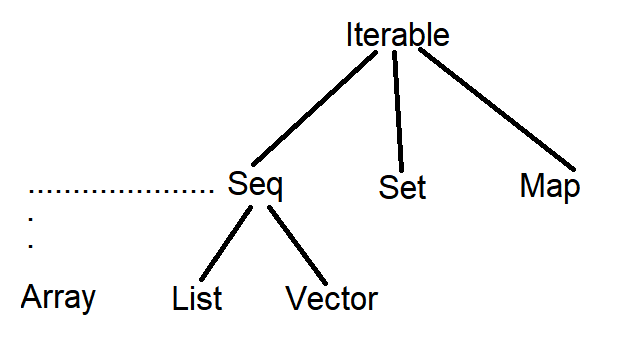
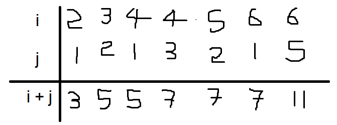
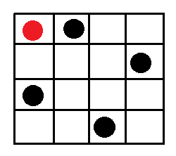

# Other Collections in Scala (Immutable)

We have seen that _Lists_ are linear. Access to the first element is much faster than access to the middle or end of a _List_. 

The Scala library also defines an alternative sequence implementation `Vector`. This one has more evenly balanced access patterns than _List_. The idea behind a `Vector` is that it is like a _tree_ with a very high branch-out factor. A small `Vector` of upto `32` elements is just an `Array`. If the `Vector` grows beyond this (`> 32` elements), then it becomes an `Array` of `sub-Arrays`, each of which have `32` elements and now it can hold `32 x 32` or `1024` elements. If the `Vector` grows even beyond `1024` elements, then each of the `sub-Arrays` will spawn `sub-sub-Arrays` that can each hold another `32` elements amounting to a holding capacity of `1024 x 32` elements.

The `Vector` can have a maximum of `five` such _sub-levels_ which gives a maximum holding capacity of `2 ^ (5 * 5)` or `power(2, 25)` elements.

To change a single element functionally in such a data structure, without modifying the `Vector` or creating a new `Vector`, we create a new `sub-Array` of 32 elements which contains the changed element, at the required level of the `Vector`. The _parents_ of this `sub-Array` will change as well to point to the correct `sub-Array` (with the changed element) and the change in pointing will also be propogated to the root `Array` at the first level of the `Vector`. The remaning `sub-Arrays` (except the root `Array` at the top level of the `Vector`) and their _parents_ retain their old structure. So to change a single element at depth `three` of the `Vector` functionally, you would potentially need to create `three Arrays`. So, in general, you have to modify as many `sub-Arrays` as is the depth of your element to be modified, within the `Vector`. 


This gives reasonably fast access times and update times for `Vectors` when compared to _Lists_ in all situations.


_Vectors_ are created analogously to _Lists_:
```
val nums = Vector(1, 2, 3, -88)
val people = Vector("Bob", "James", "Peter")
```

_Vectors_ support the same operations as _Lists_, with the exception of `::`. Instead of `x :: xs`, there is:
                    
                    x +: xs                     Create a new vector with leading elelement `x`, followed by all
                                                all elements of `xs`

                    xs :+ x                     Create a new vector with trailing element `x`, preceded by all
                                                elements of `xs`

                (Note that the `:` always points to the sequence)

A common _base class_ (super-trait) of _List_ and _Vector_ is `Seq`, the class of all _sequences_. `Seq` itself is a _subclass_ of `Iterable`. `Iterable` has other _sub-traits_ (child classes) like `Set` and `Map`. `Array` is also a collection defined in Java that has been adopted to Scala, but it is not a descendant of `Seq` which is defined in Scala and hence, `Array` is instead a seperate class.



There are automatic _conversions_ in Scala that _upcast_ an `Array` to `Seq` that support the use of _sequence_ operations.

`Arrays` and `Strings` support the same operations as `Seq` and can implicitly be converted to _sequences_ when needed. (They cannot be _subclasses_ of `Seq` because they both come from Java).
```
val xs: Array[Int] = Array(1, 2, 3)
xs.map(x => 2 * x)

val ys: String = "Hello World!"
ys.filter(_.isUpper)
```

Another simple kind of _sequence_ is the `Range`. It represents a sequence of evenly spaced integers.

Three operators to build `Ranges`:
_to_ (inclusive), _until_ (exclusive), _by_ (to determine step value):
```
val r: Range = 1 until 5                        // 1, 2, 3, 4
val s: Range = 1 to 5                           // 1, 2, 3, 4, 5
1 to 10 by 3                                    // 1, 4, 7, 10
6 to 1 by -2                                    // 6, 4, 2
```
A `Range` is represented by a compact single object with three fields: lower bound, upper bound, step value.

__Some more Sequence Operations__ (These operations work on _Vectors_, _Lists_ and _Ranges_):

All the types of _sequences_ share a common rich set of operations ('map', 'filter', 'flatMap', 'zip', 'forall', 'sum', etc.).

        xs.exists(p)                                `true` if there is an element `x` in `xs` such that the 
                                                    predicate `p(x)` holds, `false` otherwise

        xs.forall(p)                                `true` if `p(x)` holds for all elements `x` of `xs`, `false` 
                                                    otherwise

        xs.zip(ys)                                  A sequence of pairs drawn from corresponding elements of      
                                                    sequences `xs` and `ys`. If one of the sequences is longer
                                                    that the other, the longer one is truncated to make them fit.
                                                    The result will always be a sequence of the same type as `xs`.
                                                    `List(1, 2, 3).zip(Vector("a", "b"))` = `List((1, "a"), (2, "b"))`

        xs.unzip                                    Splits a sequence of pairs `xs` into two sequences, consisting
                                                    of the first, and corresponding second halves of all pairs

        xs.flatMap(f)                               Applies collection-valued function `f` (a function that returns 
                                                    a collection) to all elements of `xs` and concatenates all the 
                                                    collection results to give a single sequence

        xs.sum                                      The sum of all elements of this numeric collection

        xs.product                                  The product of all elements of this numeric collection

        xs.max                                      The maximum of all elements of this collection (an Ordering 
                                                    must exist)

        xs.min                                      The minimum of all elements of this collection


__Example: Combinations__

To list all combinations of numbers `x` and `y`, where `x` is drawn from `1 .. M` and `y` is drawn from `1 .. N`:
                
                (1 .. M).flatMap(x => (1 to N).map(y => (x, y)))        // x comes from the range 1 .. M and y     
                                                                        // comes from range 1 .. N
                // Applying map on a range which creates pairs will return the pairs in Scala's default sequence
                // which are Vectors.


__Example: Scalar Product__

To compute the _scalar product_ of two vectors:
```
def scalarProduct(xs: Vector[Double], ys: Vector[Double]): Double = 
  xs.zip(ys).map((x, y) => x * y).sum
```
Note that there is some automatic _decomposition_ going on here. Each pair of elements from `xs` and `ys` is split into its halves which are then passed as the `x` and `y` parameters to the lambda (anonymous function - which in this case take two parameters which come from the _decomposed_ pairs).

If we wanted to be more explicit, we could also write the _scalar product_ like this:
```
def scalarProduct(xs: Vector[Double], ys: Vector[Double]): Double =
  xs.zip(ys).map(xy => xy._1 * xy._2).sum                                   // Here, `xy` is a pair
```

If we wanted to be even more concise, we can write it like this:
```
def scalarProduct(xs: Vector[Double], ys: Vector[Double]): Double =
  xs.zip(ys).map(_ * _).sum
```


__Exercise:__

A number `n` is `prime` if its only divisors are `1` and `n` itself. What is a high-level way to write a test for primality of numbers ? Value conciseness over efficiency.
```
def isPrime(n: Int): Boolean =
  (2 until n).forall(n % _ != 0)
```


# Combinatorial Search and For Expressions

__Handling Nested Sequences:__

In _imperative programming_, when you search for something, you often do that by means of a loop or a series of nested loops. The loops would terminate when an element that matches the comdition is found. 
In _functional programming_, you don't have loops are your disposal but you do have _higher-order functions_. We can extend the usage of _higher-order functions_ on sequences to many calculations which are usually expressed using nested loops. It turns out that _higher-order functions_ on _sequences_ are a very good toolbox to achieve the same objective (combinatorial search) and they often lead to code that is clearer and shorter than using nested loops.

`Example:` Given a positive integer `n`, find all pairs of positive integer `i` and `j`, with `1 <= j < i < n` such that `i + j` is prime. 
For example, if `n = 7`, the sought pairs are: 




`Algorithm:`

A natural way to do this is to:
  * Generate the _sequence_ of all pairs of integers `(i, j)` such that `1 <= j < i < n`
  * Filter the pairs for which `i + j` is prime

One natural way to generate the _sequence_ of pairs is to:
  * Generate all the integers `i` between `1` and `n` (excluded)
  * For each integer `i`, generate the list of pairs `(i, 1), ..., (i, i - 1)`

This can be achieved by combining `until` and `map`:

                (1 until n).map(i => 
                  (1 until i).map(j => (i, j)))


__Generate Pairs:__

The previous step gave a _sequence_ of _sequences_, let's call it `xss`. We can combine all the _sub-sequences_ using `foldRight` with `++`:

                xss.foldRight(Seq[Int]())(_ ++ _)               // Using an empty integer sequence as argument z

Or equivalently, we use the _built-in_ method `flatten`:

                xss.flatten

This gives:

                ((1 until n).map( i => 
                  (1 until i).map(j => (i, j)))).flatten


Here's a useful law:

                xs.flatMap(f) = xs.map(f).flatten               // for any collection `xs`


Hence, the above expression can be simplified to:

                (1 until n).flatMap(j => 
                  (1 until i).map(j => (i, j)))


__Assembling the pieces:__

By reassembling the pieces, we obtain the following expression:
                (1 until n)
                  .flatMap(i => (1 until i).map(j => (i, j)))
                  .filter((x, y) => isPrime(x + y))


This works, but makes most people's head hurt. Is there a simpler way ?


`For Expressions:`

Higher-order Functions such as `map` and `flatMap` or `filter` provide powerful constructs for manipulating lists.
But sometimes, the level of abstraction required by these functions make the program difficult to understand.
In this case, Scala's `for expression` notation can help. 


__For-Expression Example:__

Let `persons` be a list of elements of class _Person_, with fields `name` and `age`.
```
case class Person(name: String, age: Int)
```
To obtain the names of persons over 20 years old, you can write:
```
for p <- persons if p.age > 20 yield p.name
```
Which is equivalent to:

        persons
          .filter(p => p.age > 20)
          .map(p => p.name)

The `for-expression` is similar to for-loops in imperative languages, except that it builds a list of the results of all iterations instead of working by _side effects_.


__Syntax of For:__

A `for-expression` is of the form:

        for s yield e

where `s` is a _sequence_ of `generators` and `filters`, and `e` is an expression whose value is returned by an iteration.
  * A `generator` is of the form `p <- e`, where `p` is a pattern and `e` an expression whose value must be a collection (and not a single value - it is adviced not to save the result of a generator into a variable within the generator itself, because only a single value will be stored inside the variable that will be updated with each iteration)
  * A `filter` is of the form `if f`, where `f` is a boolean expression
  * The _sequence_ must start with a `generator`
  * If there are several `generators` in the _sequence_, the last `generators` vary faster than the first.


Here are two examples which were previously solved with _higher-order functions_:

Given a positive integer `n`, find all the pairs of positive integers `(i, j)` such that `1 <= j < i < n`, and `i + j` is prime

        for
          i <- 1 until n
          j <- 1 until i
          if isPrime(i + j)
        yield (i, j)


__Exercise:__

Write a version of _scalarProduct_ that makes use of a `for`:

            def scalarPrduct(xs: List[Double], ys: List[Double]): Double =
              (for (x, y) <- xs.zip(ys) yield x * y).sum


`Question:` What will the following produce ? 

            (for x <- xs; y <- ys yield x * y).sum

`Answer:` It would multiply _every_ element of `xs` with _every_ element of `ys` and sum up the results (not just the corresponding elements).


# Sets

`Sets` are another basic abstraction in the Scala collections.

A `set` is written analogous to a _sequence_:
```
val fruit = Set("apple", "banana", "pear")
val s = (1 to 6).toSet
```
Most operations on _sequences_ are also available on `sets`:
```
s.map(_ + 2)
fruit.filter(_.startsWith("app"))
s.nonEmpty
```

(See `Iterables ScalaDoc` for a list of all supported operations)


__Sets vs Sequences:__

The principal differences between `sets` and `sequences` are:
  
  1. _Sets_ are unordered; the elements of a _set_ do not have a predefined order in which they appear in the _set_.
  2. _Sets_ do not have duplicate elements

                        s.map(_ / 2)                    // Set(2, 0, 3, 1)
  
  3. The fundamental operation on _sets_ is `contains`:

                        s.contains(5)                   // true


__Combanitorial Search Problem Example: N-Queens:__

The eight queens problem is to place eight queens on a chessboard so that no queen is threatned by another.
  
  * In other words, there can't be two queens in the same row, column or diagonal.





We now develop a solution for a chessboard of any size, not just 8.
One way to solve the problem is to place a queen on each row. Once we have placed `k - 1` queens, one must place the `kth` queen in a column where it's not `in check` with any other queens on the board.

The number of solutions to this problem grows as the size of the board grows. If you reach a dead end while placing the queens in the board, you have to _backtrack_ and change the positions of the previously placed queens on the board (the red dot in the example image of this problem shows one such problematic position for the first queen piece, which will lead to a dead end in a 4 x 4 chessboard).


`Algorithm:`

We can solve this problem with a _recursive_ algorithm:
  * Suppose that we have already generated all the solutions consisting of placing `k - 1` queens on a board of size `n`
  * Each solution is represented by a _list_ (of length `k - 1`) containing the numbers of the column (between `0` and `n - 1`) of the queens that have been placed previously
  * The column number of the queen in the `k - 1th` row comes first in the _list_, followed by the column number of queen in row `k - 2`, etc. The last queen in the list is the queen on row number `1`
  * The solution set is thus represented as a set of _lists_, with one element for each solution. All solutions are a _Set_ and each solution is a _list_ of column numbers
  * Now, to place the `kth` queen, we generate all possible extensions of each solution preceded by a new queen:
  
__Implementation:__

```
def queens(n: Int) =                                            // n = size of the board
  def placeQueens(k: Int): Set[List[Int]] =                     // k = how many queens still to be put on board
    if (k == 0) Set(List())
    else 
      for
        // recursive call of a problem that is one queen simpler than before.
        // `placeQueens(k-1)` is the set of solutions, so each `queen` is a solution Vector/List of column numbers
        // Now the task is to place the `kth` queen
        queens <- placeQueens(k - 1)                                
        col <- 0 until n
        // will the 'kth' queen be safe in this column relative to the queens that have already been placed
        if isSafe(col, queens)                                      
      yield col :: queens                                            
  placeQueens(n)                                                   
```


__Exercise:__

Write the function _isSafe_:
```
def isSafe(col: Int, queens: List[Int]): Boolean
```
which tests if a queen in an indicated column `col` is secure amongst the other placed queens. It is assumed that the new queen is placed in the next available row after the other placed queens (in other words, it is placed in the row `queens.length`).


`Solution:`

```
def isSafe(col: Int, queens: List[Int]): Boolean =
  // initially, `delta` is 1 because we follow `queens` directly by the column we place, ie, we place our current
  // queen in a row that directly follows the last row that the latest `queen` in `queens` was placed in
  !checks(col, 1, queens)                       
```
where `checks` predicate takes as an additional second parameter `delta`, the distance in rows between the first element's row of `queens` and the row where the _current queen_ is placed. `checks` is defined as follows:
```
// 'delta' is the distance between the row where the new queen is to be placed and the last row where the first 
// queen from the list `queens` was placed.
// REMEMBER: The column number of the queen in the `k - 1th` row comes first in the list `queens`
// REMEMBER: `checks` returns `true` if it is NOT SAFE to place the queen piece in a particular `col` for a row 
// defined by `delta`
// We donot perform a Horizontal check because by default, the algorithm will not put two queens in the same row.
def checks(col: Int, delta: Int, queens: List[Int]): Boolean = queens match
  case qcol :: others =>
    qcol == col                         // Vertical check - not safe if both columns are same
    || (qcol - col).abs == delta        // diagonal check - not safe if `qcol` and `col` lie in a diagonal
    || checks(col, delta + 1, others)   // Recursive call - check safety of `col` with positions of `qcol` in 
                                        // (k - 2), (k - 3) ... (1)
  // if `queens` is empty, the result is `false`
  case Nil => false
end checks
```


# Maps

Another fundamental collection type is the `Map`. A `map` of type `Map[Key, Value]` is a data structure that associates keys of type `Key` with values of type `Value`.
Examples:
```
val romanNumerals = Map("I" -> 1, "V" -> 5, "X" -> 10)      // A map with String `key` type and Int `value` type
val capitalOfCountry = Map("US" -> "Washington", "Switzerland" -> "Bern")  // A map with both `key` and `value` as 
                                                                           // String type
```

`Maps` are a special sub-type of `Iterable`. The type class `Map[Key, Value]` extends the _collection_ type `Iterable[(Key, Value)]`.
Therefore, `Maps` support the same collection operations as other _iterables_ do. Example:
```
val countryOfCapital = capitalOfCountry.map((x, y) => (y, x))
// Map("Washington" -> "US", "Bern" -> "Switzerland")
```
Note that `maps` extend _iterables_ of key/value `pairs`. In fact, the syntax `key -> value` is just an alternative way to write a _pair_ `(key, value)` (`->` implemented as an extension method in `Predef`).
```
extension [K, V](k: K)
  def -> (v: V) = (k, v)
```


__Maps are Functions:__

Class `[Key, Value]` also extends the function type `Key => Value`, so `maps` can be used everywhere functions can be used. In particular, `maps` can be applied to `key` arguments:
```
capitalOfCountry("US")              // "Washington"
```
Applying a `map` to a non-existing `key` gives an error:
```
capitalOfCountry("Andorra")         // java.Util.NoSuchElementException: key not found: Andorra
```
To query a `map` without knowing beforehand whether it contains a given `key`, you can use the `get` operation:
```
capitalOfCountry.get("US")          // Some("Washington")
capitalOfCountry.get("US")          // None
```
The result of a `get` operation is an `Option` value (_Some_ and _None_). The `Option` type is defined as:
```
trait Option[+A]            // A is covariant

case class Some[+A](value: A) extends Option[A]
object None extends Option[A]
```
The expression `map.get(key)` returns
  * `None` if `map` does not contain the given `key`
  * `Some(x)` if `map` associates the given `key` with the `value x`

Since `Options` are defined as _case classes_, they can be _decomposed_ using pattern matching:
```
def showCapital(county: String) = capitalOfCountry.get(country) match
  case Some(capital) => capital
  case None => "missing data"

showCapital("US")               // "Washington"
showCapital("Andorra")          // "missing data"
```
`Options` also support quite a few operations of the other collections even though they are not a _collection type_. `.map`, `.fold` and `.filter` are some of the operations supported by `Options`

In Scala, `Maps` donot return `null` (inherited from Java for interoperation between Scala and Java) for a missing `key`, because if any `value` can be `null`, you will not know beforehand whether certain operations are defined on that `value` or not. If the returned value is a `null`, you would get a `NullPointerException`. `Option` (from the `Map.get()` method) is safer than `null` because the `Option` type forces you to handle the `Some` and `None` cases (such as when using pattern matching on an `Option`). 

__REMEMBER:__ querying a `Map` directly by applying a _key_ as an argument does not return an `Option`. This means that when the _key_ is not present in the `Map`, you will get a `NoSuchElementException: key not found: <key>` error. To overcome this error, we can use the `Map.get(<key>)` method which will return `None` (an `Option`) instead of throwing an error for the missing _key_.


__Updating Map:__

Functional updates of a map are done with the `+` and `++` operations:

        m + (k -> v)                            The map that takes key 'k' and value 'v' ans is otherwise
                                                equal to 'm'. If 'k' already exists in the map, its value
                                                will be overridden to the new value 'v'. If 'k' does not exist
                                                in 'm', it will be binded to the map 'm' with value 'v'.

        m ++ kvs                                The map 'm' updated via '+' with all key/value pairs in 
                                                the collection 'kvs'.


These operations are _purely functional_. For instance:
```
val m1 = Map("red" -> 1, "blue" -> 2)       // m1 = Map(red -> 1, blue -> 2)
val m2 = m1 + ("blue" -> 3)                 // m2 = Map(red -> 1, blue -> 3)
m1                                          // Map(red -> 1, blue -> 2)
```

In the background, updating `Maps` works similar to updating values in `Vectors`.


__Sorted and Groupby:__

Two useful operations known from SQL queries are `groupBy` and `orderBy`. `orderBy` (not applied directly) on a _collection_ can be expressed with `sortWith` and `sorted`.
```
val fruit = List("apple", "pear", "orange", "pineapple")
fruit.sortWith(_.length < _.length)                                 // List("pear", "apple", "orange", "pineapple")
fruit.sorted                                                        // List("apple", "orange", "pear", "pineapple")
```

`groupBy` is available on Scala _collections_. It partitions a collection into a _map_ of _collections_ according to a _discriminator function_ `f`. 
Example:
```
// group 'fruit' by its head character
fruit.groupBy(_.head)                                              //> Map(p -> List(pear, pineapple),
                                                                   //|     a -> List(apple),
                                                                   //|     o -> List(orange))
```


__Default Values:__

So far, _maps_ were `partial functions`: Applying a _map_ to a _key, value_ in `map(key)` could lead to an _exception_, if the _key_ was not stored in the _map_. 
There is an operation `withDefaultValue` that turns a _map_ into a total function:
```
val capitalOfCountry = Map("US" -> "Washington", "Switzerland" -> "Bern")
val cap1 = capitalOfCountry.withDefaultValues("<unknown>")
cap1("Andorra")                                                           // returns the String "<unknown>"
```


`Map Example:`

A _polynomial_ can be seen as a _map_ from _exponents_ to _coefficients_.
For instance, $\mathbf{x^3 -2x + 5}$ can be represented with the map
            
                    Map(0 -> 5, 1 -> -2, 3 -> 1)

Based on this observation, lets design a class `Polynom` that represents _polynomials_ as _maps_

[Solution](poly.worksheet.sc)


__Variable Length Argument Lists:__

It's quite inconvenient to have to write
```
Polynom(Map(1 -> 2.0, 3 -> 4.0, 5 -> 6.2))
```
Can one do without the `Map(...)` ?
`Problem:` The number of `key -> value` pairs passed to _Map_ can vary.

We can accomodate this pattern using a `repeated parameter`
```
// The '*' here represents that 'bindings' can be a varying length list/sequence of pairs of type '(Int, Double)'
// To have varying length sequence of a parameter like this, we add the '*' operator to the right of the parameter
// type in the function argument
def Polynom(bindings: (Int, Double)*) =      
  Polynom(bindings.toMap.withDefaultValue(0))

Polynom(1 -> 2.0, 3 -> 4.0, 5 -> 6.2)
```
Inside the _Polynom_ function (the constructor), `bindings` is seen as a `Seq[(Int, Double)]`.


__Exercise:__

The `+` operation on _Polynom_ used _map_ concatenation with `++`. Design another version of `+` in terms of `foldLeft`:
```
def + (other: Polynom) =
  Polynom(other.terms.foldLeft(???)(addTerm))

def addTerm(terms: Map[Int, Double], term: (Int, Double)): map[Int, Double] = ???
```

[Solution](poly.worksheet.sc)

`NOTE:` This implementation of `+` using `foldLeft` will be faster than the older implementation using `++`, because we go directly on `terms` and we do a single scan with `foldLeft`. We add each term essentially with a single scan. Whereas in the older implementation with `++`, we built up a _Map_ (which is a costly process in terms of computation). We had two _Maps_ which we _folded_ using `++`.


# Putting the Pieces Together

__Task:__

Once upon a time, before smartphones, phone keys had _mnemonics_ assigned to them
```
// REMEMBER: Char is enclosed within '' and strings are enclosed within "" in Scala
val mnemonics = Map(
    '2' -> "ABC",  '3' -> "DEF", '4' -> "GHI", '5' -> "JKL", '6' -> "MNO",
    '7' -> "PQRS", '8' -> "TUV", '9' -> "WXYZ")
```
Assume you are given a dictionary `words` as a list of words.
Design a method `encode` such that 
```
encode(phoneNumber)
```
produces all phrases of words that can serve as _mnemonics_ for the phone number.
 
__Example:__ The phone number `7225247386` should have the _mnemonic_ `Scala is fun` as one element of the set of solution phrases.


__Implementation:__

```
class Coder(words: List[String]):
  val mnemonics = Map(
    '2' -> "ABC",  '3' -> "DEF", '4' -> "GHI", '5' -> "JKL", '6' -> "MNO",
    '7' -> "PQRS", '8' -> "TUV", '9' -> "WXYZ")

  /** Maps a letter to the digit it represents **/
  private val charCode: Map[Char, Char] = 
    for
      (digit, str) <- mnemonics         // (digit, str) range over all the pairs in 'mnemmonics'
      ltr <- str                        // 'ltr' ranges over all the letters (Char) in str
    yield (ltr, digit)                  // return the pair (ltr, digit), a single Char mapped to its digit

  /** Maps a word to the digit string it can represent **/
  // mapping each Char in the word with 'charCode' to get the digit string that the whole word represents
  // we convert 'word' to upper case because 'charCode' is only defined for upper case Characters
  private def wordCode(word: String): String = word.toUpperCase.map(charCode)

  /** Maps a digit string to all words in the dictionary that represents it **/
  private val wordsForNum: Map[String, List[String]] = 
    // for each word in 'words', take its digit string by calling 'wordCode' on it and use this digit string as the 
    // key for a Map. The value of this key in the Map will be a list of Strings of all the words that have this 
    // same digit string. 'wordsForNum' will return 'Nil' for digit strings that donot appear in it.
    words.groupBy(wordCode).withDefaultValue(Nil)

  /** All ways to encode a number as a list of words **/
  // Use divide and conquer principle
  def encode(number: String): Set[List[String]] = 
    if (number.isEmpty) Set(Nil)
    else
      for
        // in 'for' expressions, the collection you start with is also the collection of the result. So the result
        // in this case will also be a 'Set'
        splitPoint <- (1 to number.length).toSet
        // take the digits of 'number' upto 'splitPoint' and find the list of words that correspond to it.
        // 'word' will range over the elements of this list returned by 'wordsForNum'. Therefore, each 'word'
        // is a possible solution for the first part of 'number'
        word <- wordsForNum(number.take(splitPoint))
        // The second part of number includes the number at the 'splitPoint' and beyond. It is used in a recursive 
        // call of 'encode'. This part is smaller than 'number' as we will atleast drop one digit from 'number'.
        rest <- encode(number.drop(splitPoint))
      // putting things together
      yield word :: rest
```

__Testing:__

A test program
```
@main def code(number: String) =
  val coder = Coder(List(
    "Scala", "Python", "Ruby", "C",
    "rocks", "socks", "sucks", "works", "pack"))
  print(coder.encode(number).map(_.mkString(" ")))
```

A sample run of [coder](coder.scala):
Any command-line arguments when running the compiled binary will be used as arguments to the main function
```
> scalac coder.scala
> scala code "7225276257"
HashSet(Scala rocks, pack C rocks, pack C socks, Scala socks)
```

This problem was used to emperically compare the lines of code and performance of seven Programming Languages: 
Tcl, Python, Perl, Rexx, Java, C++ and C. The code size medians were:
  *  100 lines of code for _scripting languages_ (Tcl, Python, Perl, Rexx)
  *  200 - 300 lines of code for others

The fastest performing solutions were from C++ and C as expected. However, the average performance times were better for the _scripting languages_ compared to the others. This is because these _scripting languages_ (Tcl, Python, Perl, Rexx) have in-built data structures like _maps_ and _lists_ which can be utilized for this problem, whereas in the other languages, you had to implement these data structures on your own, and you could go horribly wrong in terms of performance, leading to very slow solutions that ruined the average performance times. 

In Scala, we ended up with a well performing solution with much shorter lines of code (about 30) and with the added advantages of _strong type safety_, _pure functional_ programming.


__Benifits of Scala:__

Scala's _immutable_ collections are:

  *  _easy to use_: few steps to do the job
  *  _concise:_ one word replaces a whole loop
  *  _safe:_ type checker is really good at catching errors
  *  _fast:_ collection operations are tuned, can be parallelized
  *  _universal:_ one vocubulary to work on all kinds of collections

This makes them an attractive tool for software development.


# Course Conclusion

__Traits of Functional Programming:__

_Functional programming_ provides a coherent set of notations and methods based on

  *  higher-order functions
  *  represent data case classes and decompose using pattern matching
  *  immutable collections
  *  absence of mutable state
  *  flexible evaluation strategies: _strict_ vs. _by name_

A useful toolkit for every programmer.
A different way of thinking about programs.


__More Material on Scala:__

`Reference material:`

[Scala Cheat Sheet](CheatSheet.md)(adapted from a forum post by `Laurent Poulain`)

[Twitter's Scala School](https://twitter.github.io/scala_school/)

[Scala Exercises by 47 Degrees](https://www.scala-exercises.org/)

[Programming in Scala, 1st ed (Free)](https://www.artima.com/pins1ed/index.html)

[Programming in Scala, 5th ed](https://www.artima.com/shop/programming_in_scala_5ed)

[The Scala Website](https://docs.scala-lang.org/)


__What Remains to Be Covered:__

Important topics we did not cover in this course:

Functional program design
 
  * How do we apply _Functional Programming_ in a larger context ?
  * What are useful design principles?

_Functional Programming_ and _state_

  * What does it mean to have _mutable state_ ?
  * What changes if we add it ?
  * How can we simulate it, if we want to stay _purely functional_ ?

_Parallel_ and _Distributed_ systems

  * how to exploit _immutability_ for _parallel execution_ ?
  * _Distributed_ collections and _big data_