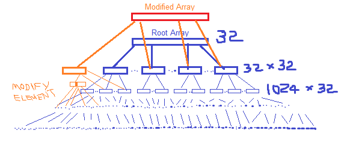

# Other Collections in Scala (Immutable)

We have seen that _Lists_ are linear. Access to the first element is much faster than access to the middle or end of a _List_. 

The Scala library also defines an alternative sequence implementation `Vector`. This one has more evenly balanced access patterns than _List_. The idea behind a `Vector` is that it is like a _tree_ with a very high branch-out factor. A small `Vector` of upto `32` elements is just an `Array`. If the `Vector` grows beyond this (`> 32` elements), then it becomes an `Array` of `sub-Arrays`, each of which have `32` elements and now it can hold `32 x 32` or `1024` elements. If the `Vector` grows even beyond `1024` elements, then each of the `sub-Arrays` will spawn `sub-sub-Arrays` that can each hold another `32` elements amounting to a holding capacity of `1024 x 32` elements.

The `Vector` can have a maximum of `five` such _sub-levels_ which gives a maximum holding capacity of `2 ^ (5 * 5)` or `power(2, 25)` elements.

To change a single element functionally in such a data structure, without modifying the `Vector` or creating a new `Vector`, we create a new `sub-Array` of 32 elements which contains the changed element, at the required level of the `Vector`. The _parents_ of this `sub-Array` will change as well to point to the correct `sub-Array` (with the changed element) and the change in pointing will also be propogated to the root `Array` at the first level of the `Vector`. The remaning `sub-Arrays` (except the root `Array` at the top level of the `Vector`) and their _parents_ retain their old structure. So to change a single element at depth `three` of the `Vector` functionally, you would potentially need to create `three Arrays`. So, in general, you have to modify as many `sub-Arrays` as is the depth of your element to be modified, within the `Vector`. 



This gives reasonably fast access times and update times for `Vectors` when compared to _Lists_ in all situations.


_Vectors_ are created analogously to _Lists_:
```
val nums = Vector(1, 2, 3, -88)
val people = Vector("Bob", "James", "Peter")
```

_Vectors_ support the same operations as _Lists_, with the exception of `::`. Instead of `x :: xs`, there is:
                    
                    x +: xs                     Create a new _Vector_ with 